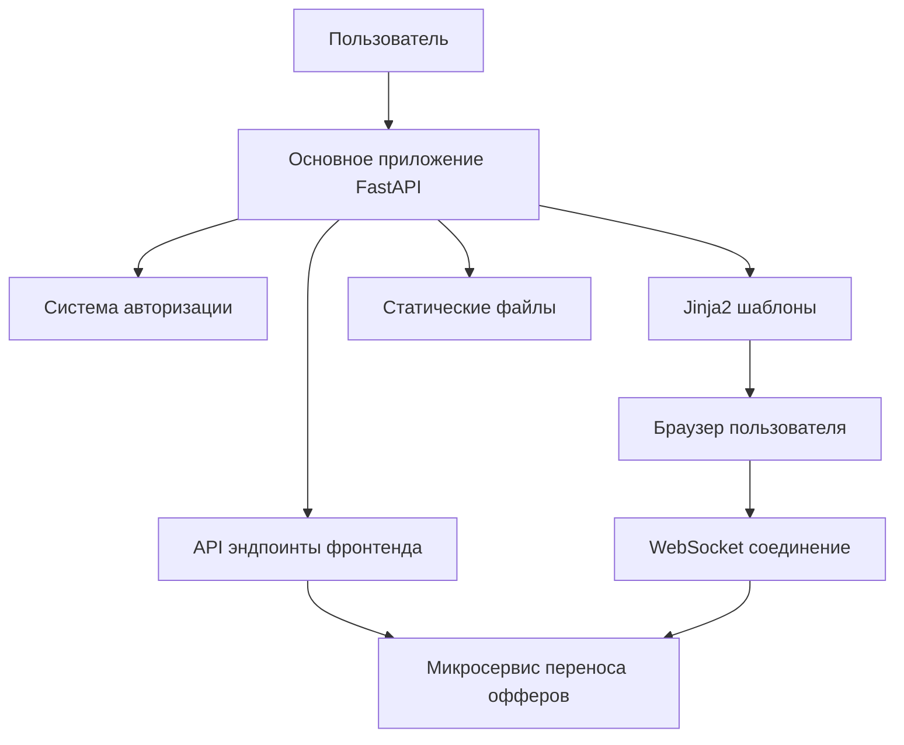

# Дизайн фронтенда системы переноса офферов Allegro

## Обзор

Данный документ описывает архитектуру и дизайн веб-интерфейса для системы переноса офферов между аккаунтами Allegro. Система построена на FastAPI с использованием Jinja2 шаблонов, интегрируется с существующей системой авторизации и взаимодействует с микросервисом переноса офферов.

## Архитектура

### Общая архитектура системы



### Структура модулей

```
app/
├── api/v1/routers/
│   └── offer_transfer.py          # Эндпоинты фронтенда
├── templates/offer_transfer/      # Шаблоны Jinja2
│   ├── base.html                  # Базовый шаблон
│   ├── index.html                 # Главная страница
│   ├── accounts.html              # Выбор аккаунтов
│   ├── offers.html                # Выбор офферов
│   ├── markets.html               # Выбор рынков
│   ├── pricing.html               # Настройка цен
│   ├── monitoring.html            # Мониторинг переноса
│   ├── templates.html             # Управление шаблонами
│   ├── metrics.html               # Системные метрики
│   └── blocks/                    # Переиспользуемые блоки
│       ├── offer_card.html
│       ├── progress_bar.html
│       ├── notification.html
│       ├── pricing_rule.html
│       └── session_monitor.html
├── static/offer_transfer/         # Статические файлы
│   ├── css/
│   │   └── custom.css            # Минимальные кастомные стили (если нужны)
│   └── js/
│       ├── main.js               # Основная логика
│       ├── api-client.js         # API клиент
│       ├── websocket-client.js   # WebSocket клиент
│       ├── components/           # JS компоненты
│       │   ├── offer-selector.js
│       │   ├── pricing-rules.js
│       │   ├── session-monitor.js
│       │   └── notification.js
│       └── utils/
│           ├── auth.js           # Утилиты авторизации
│           ├── validation.js     # Валидация форм
│           └── helpers.js        # Вспомогательные функции
└── services/
    └── offer_transfer_service.py  # Сервис для работы с микросервисом
```

### Использование Tailwind CSS

Система будет использовать Tailwind CSS для всех стилей, что обеспечит:

1. **Консистентность дизайна** - единая система дизайна
2. **Быстрая разработка** - готовые utility классы
3. **Адаптивность** - встроенные responsive классы
4. **Минимальный кастомный CSS** - практически весь стилинг через Tailwind
5. **Оптимизация размера** - только используемые стили в production

#### Подключение необходимых библиотек

```html
<!-- В базовом шаблоне app/templates/offer_transfer/base.html -->
<!DOCTYPE html>
<html lang="ru">
<head>
    <meta charset="UTF-8">
    <meta name="viewport" content="width=device-width, initial-scale=1.0">
    <title>Перенос офферов Allegro</title>
    
    <!-- Tailwind CSS -->
    <script src="https://cdn.tailwindcss.com"></script>
    <script>
      tailwind.config = {
        theme: {
          extend: {
            colors: {
              'allegro': {
                'orange': '#ff5a00',
                'dark': '#1a1a1a',
                'gray': '#f5f5f5'
              }
            }
          }
        }
      }
    </script>
    
    <!-- Alpine.js -->
    <script defer src="https://cdn.jsdelivr.net/npm/alpinejs@3.x.x/dist/cdn.min.js"></script>
    
    <!-- HTMX -->
    <script src="https://unpkg.com/htmx.org@1.9.10"></script>
    
    <!-- WebSocket extension для HTMX -->
    <script src="https://unpkg.com/htmx.org/dist/ext/ws.js"></script>
    
    
</head>
<body class="bg-gray-50 min-h-screen">
    <!-- Навигация -->
    <nav class="bg-white shadow-sm border-b">
        <div class="max-w-7xl mx-auto px-4 sm:px-6 lg:px-8">
            <div class="flex justify-between h-16">
                <div class="flex items-center">
                    <h1 class="text-xl font-semibold text-gray-900">
                        Перенос офферов Allegro
                    </h1>
                </div>
                <div class="flex items-center space-x-4">
                    <span class="text-sm text-gray-600">{{ current_user.full_name }}</span>
                    <a href="/logout" class="text-sm text-gray-500 hover:text-gray-700">Выйти</a>
                </div>
            </div>
        </div>
    </nav>
    
    <!-- Основной контент -->
    <main class="max-w-7xl mx-auto py-6 px-4 sm:px-6 lg:px-8">
        
    </main>
    
    <!-- Контейнер для уведомлений -->
    <div x-data="notificationManager()" 
         x-show="notifications.length > 0"
         class="fixed top-4 right-4 z-50 space-y-2">
        <!-- Код уведомлений из предыдущего примера -->
    </div>
    
    <!-- Глобальные скрипты -->
    <script>
        // Глобальные функции и обработчики ошибок
        
    </script>
    
    
</body>
</html>
```

#### Примеры компонентов с Tailwind

**Карточка оффера:**
```html
<div class="bg-white rounded-lg shadow-md border border-gray-200 p-4 hover:shadow-lg transition-shadow">
  <div class="flex items-start space-x-4">
    
    <div class="flex-1 min-w-0">
      <h3 class="text-lg font-semibold text-gray-900 truncate">{{ offer.name }}</h3>
      <p class="text-sm text-gray-500">ID: {{ offer.id }}</p>
      <p class="text-lg font-bold text-allegro-orange">{{ offer.price.amount }} {{ offer.price.currency }}</p>
    </div>
    <input type="checkbox" class="w-5 h-5 text-allegro-orange rounded focus:ring-allegro-orange">
  </div>
</div>
```

**Прогресс бар:**
```html
<div class="w-full bg-gray-200 rounded-full h-2.5">
  <div class="bg-allegro-orange h-2.5 rounded-full transition-all duration-300" 
       style="width: {{ progress_percentage }}%"></div>
</div>
```

**Кнопки:**
```html
<!-- Основная кнопка -->
<button class="bg-allegro-orange hover:bg-orange-600 text-white font-semibold py-2 px-4 rounded-lg transition-colors">
  Запустить перенос
</button>

<!-- Вторичная кнопка -->
<button class="bg-gray-200 hover:bg-gray-300 text-gray-800 font-semibold py-2 px-4 rounded-lg transition-colors">
  Отмена
</button>

<!-- Кнопка опасного действия -->
<button class="bg-red-500 hover:bg-red-600 text-white font-semibold py-2 px-4 rounded-lg transition-colors">
  Удалить
</button>
```

**Уведомления:**
```html
<!-- Успех -->
<div class="bg-green-100 border border-green-400 text-green-700 px-4 py-3 rounded-lg mb-4">
  <div class="flex items-center">
    <span class="text-green-500 mr-2">✅</span>
    <span>Операция выполнена успешно!</span>
    <button class="ml-auto text-green-700 hover:text-green-900">×</button>
  </div>
</div>

<!-- Ошибка -->
<div class="bg-red-100 border border-red-400 text-red-700 px-4 py-3 rounded-lg mb-4">
  <div class="flex items-center">
    <span class="text-red-500 mr-2">❌</span>
    <span>Произошла ошибка!</span>
    <button class="ml-auto text-red-700 hover:text-red-900">×</button>
  </div>
</div>
```

**Модальное окно:**
```html
<div class="fixed inset-0 bg-black bg-opacity-50 flex items-center justify-center z-50">
  <div class="bg-white rounded-lg p-6 max-w-md w-full mx-4">
    <h3 class="text-lg font-semibold mb-4">Подтверждение</h3>
    <p class="text-gray-600 mb-6">Вы уверены, что хотите запустить перенос?</p>
    <div class="flex space-x-3">
      <button class="flex-1 bg-allegro-orange hover:bg-orange-600 text-white py-2 px-4 rounded-lg">
        Да, запустить
      </button>
      <button class="flex-1 bg-gray-200 hover:bg-gray-300 text-gray-800 py-2 px-4 rounded-lg">
        Отмена
      </button>
    </div>
  </div>
</div>
```

### Минимизация JavaScript

Вместо сложных JS компонентов будем использовать:

1. **Alpine.js** - для простой интерактивности
2. **HTMX** - для AJAX запросов без написания JS
3. **Встроенные браузерные API** - для базовой функциональности

#### Пример с Alpine.js

```html
<div x-data="{ 
  selectedOffers: [],
  selectAll() {
    this.selectedOffers = this.allOffers.map(o => o.id);
  },
  deselectAll() {
    this.selectedOffers = [];
  }
}">
  <div class="flex space-x-4 mb-4">
    <button @click="selectAll()" class="bg-gray-200 hover:bg-gray-300 px-4 py-2 rounded-lg">
      Выбрать все
    </button>
    <button @click="deselectAll()" class="bg-gray-200 hover:bg-gray-300 px-4 py-2 rounded-lg">
      Снять выбор
    </button>
    <span class="text-gray-600 py-2">
      Выбрано: <span x-text="selectedOffers.length"></span>
    </span>
  </div>
  
  <div class="space-y-4">
    <template x-for="offer in offers" :key="offer.id">
      <div class="bg-white rounded-lg shadow-md border p-4">
        <label class="flex items-center space-x-3">
          <input type="checkbox" 
                 :value="offer.id" 
                 x-model="selectedOffers"
                 class="w-5 h-5 text-allegro-orange rounded">
          <div class="flex-1">
            <h3 class="font-semibold" x-text="offer.name"></h3>
            <p class="text-gray-500" x-text="'ID: ' + offer.id"></p>
          </div>
        </label>
      </div>
    </template>
  </div>
</div>
```

#### Пример с HTMX

```html
<!-- Форма с автоматической отправкой -->
<form hx-post="/api/v1/offer-transfer/compare-offers" 
      hx-target="#offers-list" 
      hx-indicator="#loading">
  <select name="source_account" class="w-full p-2 border rounded-lg">
    <option value="">Выберите исходный аккаунт...</option>
    
    <option value="{{ account.id }}">{{ account.name }}</option>
    
  </select>
  
  <select name="target_account" class="w-full p-2 border rounded-lg mt-4">
    <option value="">Выберите целевой аккаунт...</option>
    
    <option value="{{ account.id }}">{{ account.name }}</option>
    
  </select>
  
  <button type="submit" 
          class="w-full bg-allegro-orange hover:bg-orange-600 text-white py-2 px-4 rounded-lg mt-4">
    Сравнить офферы
  </button>
</form>

<div id="loading" class="htmx-indicator">
  <div class="flex items-center justify-center py-8">
    <div class="animate-spin rounded-full h-8 w-8 border-b-2 border-allegro-orange"></div>
    <span class="ml-2 text-gray-600">Загрузка...</span>
  </div>
</div>

<div id="offers-list" class="mt-6">
  <!-- Результаты загружаются сюда -->
</div>
```

## Компоненты и интерфейсы

### 1. Система авторизации

#### AuthService (JavaScript)
```javascript
class AuthService {
    static async getJWTForMicroservice() {
        // Создает JWT токен для микросервиса используя PROJECT_NAME
        const response = await fetch('/api/v1/offer-transfer/auth/token', {
            method: 'POST',
            credentials: 'include'
        });
        return response.json();
    }
    
    static async validateSession() {
        // Проверяет валидность сессии пользователя
    }
    
    static redirectToLogin(nextUrl) {
        // Перенаправляет на страницу логина с параметром next
    }
}
```

#### Эндпоинт создания JWT токена
```python
@router.post("/auth/token")
async def create_microservice_token(
    current_user: User = Depends(get_current_user_optional)
) -> dict:
    """Создает JWT токен для микросервиса переноса офферов"""
    if not current_user:
        raise HTTPException(status_code=401, detail="Not authenticated")
    
    # Используем PROJECT_NAME как user_id для микросервиса
    token = create_access_token(user_id=settings.PROJECT_NAME)
    return {"access_token": token, "token_type": "bearer"}
```

### 2. API клиент для микросервиса

#### MicroserviceClient (JavaScript)
```javascript
class MicroserviceClient {
    constructor() {
        this.baseURL = '/api/v1/offer-transfer/proxy';
        this.token = null;
    }
    
    async ensureToken() {
        if (!this.token) {
            const tokenData = await AuthService.getJWTForMicroservice();
            this.token = tokenData.access_token;
        }
    }
    
    async request(endpoint, options = {}) {
        await this.ensureToken();
        
        const response = await fetch(`${this.baseURL}${endpoint}`, {
            ...options,
            headers: {
                'Authorization': `Bearer ${this.token}`,
                'Content-Type': 'application/json',
                ...options.headers
            }
        });
        
        if (response.status === 401) {
            this.token = null;
            await this.ensureToken();
            return this.request(endpoint, options);
        }
        
        return response;
    }
}
```

### 3. Прокси-сервис для микросервиса

#### OfferTransferService (Python)
```python
class OfferTransferService:
    def __init__(self):
        self.base_url = settings.MICRO_SERVICE_URL
        self.session = httpx.AsyncClient()
    
    async def proxy_request(
        self, 
        method: str, 
        endpoint: str, 
        token: str,
        **kwargs
    ) -> httpx.Response:
        """Проксирует запросы к микросервису"""
        headers = {
            "Authorization": f"Bearer {token}",
            "Content-Type": "application/json"
        }
        
        url = f"{self.base_url}{endpoint}"
        response = await self.session.request(
            method=method,
            url=url,
            headers=headers,
            **kwargs
        )
        
        return response
    
    async def get_user_tokens(self, token: str) -> dict:
        """Получает список токенов пользователя"""
        response = await self.proxy_request(
            "GET", "/api/v1/tokens/user-tokens", token
        )
        return response.json()
    
    async def compare_offers(
        self, 
        token: str, 
        source_token_id: str, 
        target_token_id: str
    ) -> dict:
        """Сравнивает офферы между аккаунтами"""
        response = await self.proxy_request(
            "POST", 
            "/api/v1/offer-transfer/compare-offers",
            token,
            json={
                "source_token_id": source_token_id,
                "target_token_id": target_token_id
            }
        )
        return response.json()
```

### 4. WebSocket клиент

#### WebSocketClient (JavaScript)
```javascript
class WebSocketClient {
    constructor(sessionId) {
        this.sessionId = sessionId;
        this.ws = null;
        this.callbacks = new Map();
        this.reconnectAttempts = 0;
        this.maxReconnectAttempts = 5;
    }
    
    async connect() {
        const token = await AuthService.getJWTForMicroservice();
        const wsUrl = `${this.getWebSocketURL()}/api/v1/offer-transfer/session/${this.sessionId}/monitor?token=${token.access_token}`;
        
        this.ws = new WebSocket(wsUrl);
        this.setupEventHandlers();
    }
    
    setupEventHandlers() {
        this.ws.onopen = () => {
            console.log('WebSocket connected');
            this.reconnectAttempts = 0;
            this.emit('connected');
        };
        
        this.ws.onmessage = (event) => {
            const data = JSON.parse(event.data);
            this.emit(data.type, data.data);
        };
        
        this.ws.onclose = () => {
            this.handleReconnect();
        };
        
        this.ws.onerror = (error) => {
            console.error('WebSocket error:', error);
            this.emit('error', error);
        };
    }
    
    on(event, callback) {
        if (!this.callbacks.has(event)) {
            this.callbacks.set(event, []);
        }
        this.callbacks.get(event).push(callback);
    }
    
    emit(event, data) {
        const callbacks = this.callbacks.get(event) || [];
        callbacks.forEach(callback => callback(data));
    }
}
```

## Модели данных

### 1. Модели фронтенда (JavaScript)

```javascript
// Модель сессии переноса
class TransferSession {
    constructor(data) {
        this.id = data.id;
        this.status = data.status;
        this.sourceAccount = data.source_account;
        this.targetAccount = data.target_account;
        this.totalOffers = data.total_offers;
        this.processedOffers = data.processed_offers;
        this.successfulOffers = data.successful_offers;
        this.failedOffers = data.failed_offers;
        this.progressPercentage = data.progress_percentage;
        this.markets = data.markets;
        this.pricingRules = data.pricing_rules;
        this.createdAt = new Date(data.created_at);
        this.startedAt = data.started_at ? new Date(data.started_at) : null;
        this.completedAt = data.completed_at ? new Date(data.completed_at) : null;
    }
    
    get isActive() {
        return ['pending', 'running'].includes(this.status);
    }
    
    get canBePaused() {
        return this.status === 'running';
    }
    
    get canBeResumed() {
        return this.status === 'paused';
    }
}

// Модель оффера
class Offer {
    constructor(data) {
        this.id = data.id;
        this.externalId = data.external_id;
        this.name = data.name;
        this.price = data.price;
        this.stock = data.stock;
        this.category = data.category;
        this.images = data.images || [];
        this.createdAt = new Date(data.created_at);
        this.updatedAt = new Date(data.updated_at);
        this.selected = false;
    }
    
    get mainImage() {
        return this.images.length > 0 ? this.images[0] : null;
    }
    
    get formattedPrice() {
        return `${this.price.amount} ${this.price.currency}`;
    }
}

// Модель правила ценообразования
class PricingRule {
    constructor(marketCode, type = 'multiply') {
        this.marketCode = marketCode;
        this.type = type;
        this.multiplier = 1.0;
        this.addAmount = 0;
        this.markupPercent = 0;
        this.customFormula = '';
    }
    
    toJSON() {
        const rule = {
            market_code: this.marketCode,
            type: this.type
        };
        
        switch (this.type) {
            case 'multiply':
                rule.multiplier = this.multiplier;
                break;
            case 'add':
                rule.add_amount = this.addAmount;
                break;
            case 'convert_with_markup':
                rule.markup_percent = this.markupPercent;
                break;
            case 'custom':
                rule.custom_formula = this.customFormula;
                break;
        }
        
        return rule;
    }
}
```

### 2. Схемы ответов API (Python)

```python
from pydantic import BaseModel
from typing import List, Optional, Dict, Any
from datetime import datetime

class OfferSummaryResponse(BaseModel):
    id: str
    external_id: str
    name: str
    price: Dict[str, Any]
    stock: int
    category: str
    images: List[str]
    created_at: datetime
    updated_at: datetime

class CompareOffersResponse(BaseModel):
    source_account: str
    target_account: str
    available_offers: List[OfferSummaryResponse]
    total_count: int
    comparison_completed_at: datetime

class TransferSessionResponse(BaseModel):
    id: str
    status: str
    source_account: str
    target_account: str
    total_offers: int
    processed_offers: int
    successful_offers: int
    failed_offers: int
    progress_percentage: float
    markets: List[str]
    pricing_rules: List[Dict[str, Any]]
    created_at: datetime
    started_at: Optional[datetime] = None
    completed_at: Optional[datetime] = None
```

## Обработка ошибок

### 1. Система уведомлений с Alpine.js

#### Компонент уведомлений
```html
<div x-data="notificationManager()" 
     x-show="notifications.length > 0"
     class="fixed top-4 right-4 z-50 space-y-2">
  <template x-for="notification in notifications" :key="notification.id">
    <div x-show="notification.visible"
         x-transition:enter="transform ease-out duration-300 transition"
         x-transition:enter-start="translate-y-2 opacity-0 sm:translate-y-0 sm:translate-x-2"
         x-transition:enter-end="translate-y-0 opacity-100 sm:translate-x-0"
         x-transition:leave="transition ease-in duration-100"
         x-transition:leave-start="opacity-100"
         x-transition:leave-end="opacity-0"
         :class="{
           'bg-green-100 border-green-400 text-green-700': notification.type === 'success',
           'bg-red-100 border-red-400 text-red-700': notification.type === 'error',
           'bg-yellow-100 border-yellow-400 text-yellow-700': notification.type === 'warning',
           'bg-blue-100 border-blue-400 text-blue-700': notification.type === 'info'
         }"
         class="max-w-sm w-full border px-4 py-3 rounded-lg shadow-lg">
      <div class="flex items-center">
        <span x-text="getIcon(notification.type)" class="mr-2"></span>
        <span x-text="notification.message" class="flex-1"></span>
        <button @click="removeNotification(notification.id)" 
                class="ml-2 hover:opacity-75">×</button>
      </div>
    </div>
  </template>
</div>

<script>
function notificationManager() {
  return {
    notifications: [],
    nextId: 1,
    
    show(type, message, duration = 5000) {
      const notification = {
        id: this.nextId++,
        type,
        message,
        visible: true
      };
      
      this.notifications.push(notification);
      
      if (duration > 0) {
        setTimeout(() => {
          this.removeNotification(notification.id);
        }, duration);
      }
    },
    
    removeNotification(id) {
      const index = this.notifications.findIndex(n => n.id === id);
      if (index > -1) {
        this.notifications[index].visible = false;
        setTimeout(() => {
          this.notifications.splice(index, 1);
        }, 100);
      }
    },
    
    getIcon(type) {
      const icons = {
        'error': '❌',
        'warning': '⚠️',
        'info': 'ℹ️',
        'success': '✅'
      };
      return icons[type] || 'ℹ️';
    }
  }
}

// Глобальная функция для показа уведомлений
window.showNotification = function(type, message, duration) {
  // Найти компонент уведомлений и вызвать метод show
  const notificationComponent = document.querySelector('[x-data*="notificationManager"]');
  if (notificationComponent && notificationComponent._x_dataStack) {
    notificationComponent._x_dataStack[0].show(type, message, duration);
  }
};
</script>
```

### 2. Обработчик ошибок с HTMX

#### HTMX обработка ошибок
```html
<script>
// Глобальный обработчик ошибок HTMX
document.body.addEventListener('htmx:responseError', function(evt) {
  const status = evt.detail.xhr.status;
  let message = 'Произошла ошибка';
  
  switch (status) {
    case 400:
      try {
        const errorData = JSON.parse(evt.detail.xhr.responseText);
        message = errorData.detail || 'Ошибка валидации данных';
      } catch (e) {
        message = 'Ошибка валидации данных';
      }
      showNotification('error', message);
      break;
    case 401:
      showNotification('error', 'Сессия истекла');
      setTimeout(() => {
        window.location.href = `/login?next=${encodeURIComponent(window.location.pathname)}`;
      }, 2000);
      break;
    case 403:
      showNotification('error', 'Недостаточно прав для выполнения операции');
      break;
    case 429:
      showNotification('warning', 'Превышен лимит запросов. Попробуйте позже');
      break;
    case 500:
      showNotification('error', 'Ошибка сервера. Попробуйте позже');
      break;
    default:
      showNotification('error', `Ошибка: ${evt.detail.xhr.statusText}`);
  }
});

// Обработка сетевых ошибок
document.body.addEventListener('htmx:sendError', function(evt) {
  showNotification('error', 'Ошибка сети. Проверьте подключение к интернету');
});

// Показ успешных операций
document.body.addEventListener('htmx:afterRequest', function(evt) {
  if (evt.detail.xhr.status >= 200 && evt.detail.xhr.status < 300) {
    const successMessage = evt.detail.xhr.getResponseHeader('X-Success-Message');
    if (successMessage) {
      showNotification('success', successMessage);
    }
  }
});
</script>
```

## Стратегия тестирования

### 1. Модульные тесты (Python)

```python
# tests/test_offer_transfer_service.py
import pytest
from unittest.mock import AsyncMock, patch
from app.services.offer_transfer_service import OfferTransferService

@pytest.mark.asyncio
async def test_get_user_tokens():
    service = OfferTransferService()
    
    with patch.object(service, 'proxy_request') as mock_request:
        mock_response = AsyncMock()
        mock_response.json.return_value = {"tokens": []}
        mock_request.return_value = mock_response
        
        result = await service.get_user_tokens("test_token")
        
        assert result == {"tokens": []}
        mock_request.assert_called_once_with(
            "GET", "/api/v1/tokens/user-tokens", "test_token"
        )

@pytest.mark.asyncio
async def test_compare_offers():
    service = OfferTransferService()
    
    with patch.object(service, 'proxy_request') as mock_request:
        mock_response = AsyncMock()
        mock_response.json.return_value = {
            "available_offers": [],
            "total_count": 0
        }
        mock_request.return_value = mock_response
        
        result = await service.compare_offers("token", "source", "target")
        
        assert result["total_count"] == 0
```

### 2. Интеграционные тесты (Python)

```python
# tests/test_offer_transfer_routes.py
import pytest
from fastapi.testclient import TestClient
from unittest.mock import patch, AsyncMock

def test_create_microservice_token_unauthorized(client: TestClient):
    response = client.post("/api/v1/offer-transfer/auth/token")
    assert response.status_code == 401

def test_create_microservice_token_success(client: TestClient, mock_user):
    with patch('app.api.deps.get_current_user_optional', return_value=mock_user):
        response = client.post("/api/v1/offer-transfer/auth/token")
        assert response.status_code == 200
        data = response.json()
        assert "access_token" in data
        assert data["token_type"] == "bearer"
```

### 3. E2E тесты (JavaScript)

```javascript
// tests/e2e/offer-transfer.test.js
describe('Offer Transfer Flow', () => {
    beforeEach(() => {
        cy.login();
        cy.visit('/offer-transfer');
    });
    
    it('should complete full transfer flow', () => {
        // Выбор аккаунтов
        cy.get('#source-account').select('Account 1');
        cy.get('#target-account').select('Account 2');
        cy.get('#compare-accounts-btn').click();
        
        // Выбор офферов
        cy.get('.offer-item').first().find('input[type="checkbox"]').check();
        cy.get('#proceed-to-markets').click();
        
        // Выбор рынков
        cy.get('#market-SK').check();
        cy.get('#proceed-to-pricing').click();
        
        // Настройка цен
        cy.get('#multiplier-SK').clear().type('2.0');
        cy.get('#start-transfer-btn').click();
        
        // Подтверждение
        cy.get('.confirm-dialog').should('be.visible');
        cy.get('.confirm-btn').click();
        
        // Мониторинг
        cy.get('.session-monitor').should('be.visible');
        cy.get('.progress-bar').should('exist');
    });
});
```

## Производительность и оптимизация

### 1. Пагинация с HTMX

```html
<!-- Пагинация для больших списков офферов -->
<div id="offers-container" class="space-y-4">
  
  <div class="bg-white rounded-lg shadow-md border p-4">
    <!-- Содержимое оффера -->
  </div>
  
</div>

<!-- Кнопка "Загрузить еще" -->
<div class="text-center mt-6" id="load-more-container">
  
  <button hx-get="/api/v1/offer-transfer/offers?page={{ next_page }}"
          hx-target="#offers-container"
          hx-swap="beforeend"
          hx-select="#offers-container > *"
          hx-indicator="#loading-more"
          class="bg-allegro-orange hover:bg-orange-600 text-white px-6 py-2 rounded-lg">
    Загрузить еще
  </button>
  <div id="loading-more" class="htmx-indicator mt-2">
    <div class="animate-spin rounded-full h-6 w-6 border-b-2 border-allegro-orange mx-auto"></div>
  </div>
  
</div>
```

### 2. Поиск с автодополнением

```html
<div x-data="{ 
  searchQuery: '', 
  searchResults: [],
  isSearching: false 
}">
  <div class="relative">
    <input type="text" 
           x-model="searchQuery"
           @input.debounce.300ms="
             if (searchQuery.length > 2) {
               isSearching = true;
               $el.setAttribute('hx-get', '/api/v1/offer-transfer/search?q=' + encodeURIComponent(searchQuery));
               htmx.trigger($el, 'search');
             }
           "
           hx-target="#search-results"
           hx-trigger="search"
           placeholder="Поиск офферов..."
           class="w-full pl-10 pr-4 py-2 border border-gray-300 rounded-lg focus:ring-2 focus:ring-allegro-orange focus:border-transparent">
    
    <div class="absolute inset-y-0 left-0 pl-3 flex items-center pointer-events-none">
      <svg class="h-5 w-5 text-gray-400" fill="none" stroke="currentColor" viewBox="0 0 24 24">
        <path stroke-linecap="round" stroke-linejoin="round" stroke-width="2" d="M21 21l-6-6m2-5a7 7 0 11-14 0 7 7 0 0114 0z"></path>
      </svg>
    </div>
    
    <div x-show="isSearching" class="absolute inset-y-0 right-0 pr-3 flex items-center">
      <div class="animate-spin rounded-full h-4 w-4 border-b-2 border-allegro-orange"></div>
    </div>
  </div>
  
  <div id="search-results" class="mt-4"></div>
</div>
```

### 3. Кэширование через браузерные API

```html
<script>
// Простое кэширование через sessionStorage
function cacheData(key, data, ttl = 300000) { // 5 минут
  const item = {
    data: data,
    timestamp: Date.now(),
    ttl: ttl
  };
  sessionStorage.setItem(key, JSON.stringify(item));
}

function getCachedData(key) {
  const item = sessionStorage.getItem(key);
  if (!item) return null;
  
  const parsed = JSON.parse(item);
  if (Date.now() - parsed.timestamp > parsed.ttl) {
    sessionStorage.removeItem(key);
    return null;
  }
  
  return parsed.data;
}

// Интеграция с HTMX для кэширования
document.body.addEventListener('htmx:beforeRequest', function(evt) {
  const url = evt.detail.requestConfig.url;
  const method = evt.detail.requestConfig.verb;
  
  // Кэшируем только GET запросы
  if (method === 'GET') {
    const cached = getCachedData(url);
    if (cached) {
      // Отменяем запрос и используем кэшированные данные
      evt.preventDefault();
      evt.detail.target.innerHTML = cached;
    }
  }
});

document.body.addEventListener('htmx:afterRequest', function(evt) {
  const url = evt.detail.requestConfig.url;
  const method = evt.detail.requestConfig.verb;
  
  // Кэшируем успешные GET ответы
  if (method === 'GET' && evt.detail.xhr.status === 200) {
    cacheData(url, evt.detail.xhr.responseText);
  }
});
</script>
```

## Безопасность

### 1. Валидация с Alpine.js

```html
<!-- Валидация формы настройки цен -->
<form x-data="pricingForm()" @submit.prevent="submitForm()">
  <div class="space-y-6">
    <template x-for="market in selectedMarkets" :key="market">
      <div class="bg-white p-6 rounded-lg border">
        <h3 class="text-lg font-semibold mb-4" x-text="'Правило для рынка ' + market"></h3>
        
        <div class="mb-4">
          <label class="block text-sm font-medium text-gray-700 mb-2">Тип правила</label>
          <select x-model="rules[market].type" 
                  class="w-full p-2 border border-gray-300 rounded-lg focus:ring-2 focus:ring-allegro-orange">
            <option value="multiply">Умножить на коэффициент</option>
            <option value="add">Добавить фиксированную сумму</option>
            <option value="convert_with_markup">Конвертировать с наценкой (%)</option>
          </select>
        </div>
        
        <div x-show="rules[market].type === 'multiply'" class="mb-4">
          <label class="block text-sm font-medium text-gray-700 mb-2">Коэффициент</label>
          <input type="number" 
                 x-model.number="rules[market].multiplier"
                 min="0.1" 
                 max="100" 
                 step="0.1"
                 class="w-full p-2 border border-gray-300 rounded-lg focus:ring-2 focus:ring-allegro-orange"
                 :class="{ 'border-red-500': errors[market + '_multiplier'] }">
          <p x-show="errors[market + '_multiplier']" 
             x-text="errors[market + '_multiplier']" 
             class="text-red-500 text-sm mt-1"></p>
        </div>
        
        <div x-show="rules[market].type === 'convert_with_markup'" class="mb-4">
          <label class="block text-sm font-medium text-gray-700 mb-2">Наценка (%)</label>
          <input type="number" 
                 x-model.number="rules[market].markupPercent"
                 min="0" 
                 max="1000" 
                 step="1"
                 class="w-full p-2 border border-gray-300 rounded-lg focus:ring-2 focus:ring-allegro-orange"
                 :class="{ 'border-red-500': errors[market + '_markup'] }">
          <p x-show="errors[market + '_markup']" 
             x-text="errors[market + '_markup']" 
             class="text-red-500 text-sm mt-1"></p>
        </div>
      </div>
    </template>
  </div>
  
  <div class="mt-6 flex space-x-4">
    <button type="submit" 
            :disabled="!isValid"
            :class="{ 'opacity-50 cursor-not-allowed': !isValid }"
            class="bg-allegro-orange hover:bg-orange-600 text-white px-6 py-2 rounded-lg">
      Запустить перенос
    </button>
  </div>
</form>

<script>
function pricingForm() {
  return {
    selectedMarkets: ['SK', 'CZ'], // Пример
    rules: {
      'SK': { type: 'multiply', multiplier: 1.0, markupPercent: 0 },
      'CZ': { type: 'multiply', multiplier: 1.0, markupPercent: 0 }
    },
    errors: {},
    
    get isValid() {
      this.validateRules();
      return Object.keys(this.errors).length === 0;
    },
    
    validateRules() {
      this.errors = {};
      
      for (const market of this.selectedMarkets) {
        const rule = this.rules[market];
        
        if (rule.type === 'multiply') {
          if (rule.multiplier <= 0 || rule.multiplier > 100) {
            this.errors[market + '_multiplier'] = 'Коэффициент должен быть от 0.1 до 100';
          }
        }
        
        if (rule.type === 'convert_with_markup') {
          if (rule.markupPercent < 0 || rule.markupPercent > 1000) {
            this.errors[market + '_markup'] = 'Наценка должна быть от 0% до 1000%';
          }
        }
      }
    },
    
    submitForm() {
      if (this.isValid) {
        // Отправка формы через HTMX или fetch
        const formData = {
          pricing_rules: Object.entries(this.rules).map(([market, rule]) => ({
            market_code: market,
            ...rule
          }))
        };
        
        // Можно использовать HTMX или обычный fetch
        fetch('/api/v1/offer-transfer/start', {
          method: 'POST',
          headers: { 'Content-Type': 'application/json' },
          body: JSON.stringify(formData)
        }).then(response => {
          if (response.ok) {
            showNotification('success', 'Перенос запущен успешно!');
          }
        }).catch(error => {
          showNotification('error', 'Ошибка при запуске переноса');
        });
      }
    }
  }
}
</script>
```

### 2. Защита от XSS

```python
# Экранирование данных в шаблонах
from markupsafe import escape

def safe_render_offer_name(name: str) -> str:
    """Безопасное отображение названия оффера"""
    return escape(name)

def safe_render_json(data: dict) -> str:
    """Безопасное отображение JSON данных"""
    import json
    return escape(json.dumps(data))
```

## Мониторинг и логирование

### 1. Логирование действий пользователя

```python
import logging
from app.services.standardized_logger import StandardizedLogger

logger = StandardizedLogger(__name__)

async def log_user_action(
    user_id: int,
    action: str,
    details: dict = None
):
    """Логирует действия пользователя в системе переноса офферов"""
    logger.info(
        f"User action: {action}",
        extra={
            "user_id": user_id,
            "action": action,
            "details": details or {},
            "component": "offer_transfer_frontend"
        }
    )
```

### 2. Метрики производительности

```javascript
// Сбор метрик производительности
class PerformanceMonitor {
    static startTimer(name) {
        performance.mark(`${name}-start`);
    }
    
    static endTimer(name) {
        performance.mark(`${name}-end`);
        performance.measure(name, `${name}-start`, `${name}-end`);
        
        const measure = performance.getEntriesByName(name)[0];
        console.log(`${name}: ${measure.duration.toFixed(2)}ms`);
        
        // Отправка метрик на сервер (опционально)
        this.sendMetric(name, measure.duration);
    }
    
    static sendMetric(name, duration) {
        // Отправка метрик на сервер для анализа
        fetch('/api/v1/metrics/performance', {
            method: 'POST',
            headers: { 'Content-Type': 'application/json' },
            body: JSON.stringify({ name, duration, timestamp: Date.now() })
        }).catch(console.error);
    }
}
```

Этот дизайн обеспечивает:

1. **Модульность** - четкое разделение компонентов и ответственности
2. **Масштабируемость** - возможность легкого добавления новых функций
3. **Производительность** - оптимизации для работы с большими объемами данных
4. **Безопасность** - защита от основных уязвимостей
5. **Тестируемость** - архитектура, позволяющая эффективное тестирование
6. **Интеграцию** - плавную интеграцию с существующей системой