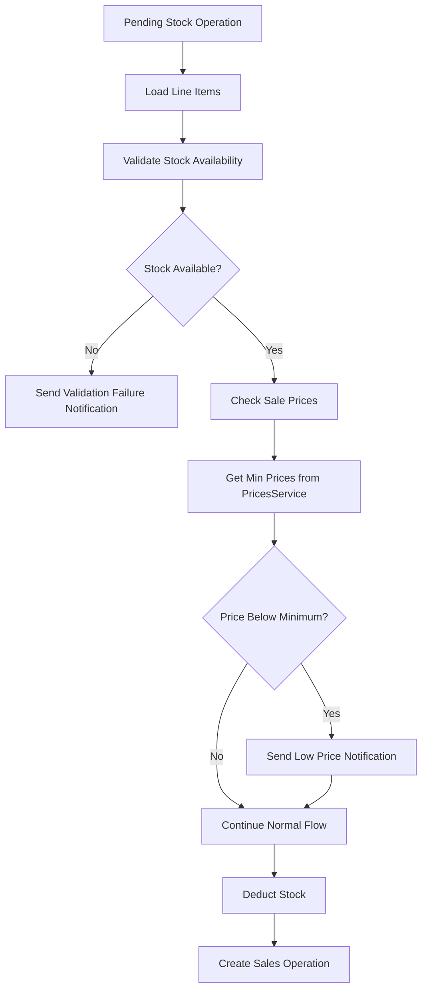

# Design Document

## Overview

Система уведомлений о продажах по цене ниже минимальной интегрируется в существующий процесс обработки pending stock operations в `StockSynchronizationService`. Система проверяет цену продажи каждой позиции заказа против минимальной цены из `PricesService` и отправляет уведомления через существующий `StockSyncNotificationService` при обнаружении нарушений.

Ключевые принципы дизайна:
- Минимальное вмешательство в существующую логику
- Асинхронная обработка без блокировки основных процессов
- Использование существующих сервисов и инфраструктуры
- Надежная обработка ошибок с логированием

## Architecture

### Integration Point

Проверка цен интегрируется в метод `_validate_and_deduct_stock()` класса `StockSynchronizationService` после успешной валидации остатков, но до создания операции продажи. Это обеспечивает:

1. Доступность всех данных о заказе (line_items)
2. Подтверждение того, что операция будет выполнена
3. Возможность получить цену продажи из данных заказа

### Data Flow



### Service Integration

Новая функциональность использует существующие сервисы:

- **PricesService**: Получение минимальных цен по SKU
- **StockSyncNotificationService**: Отправка уведомлений в Telegram
- **StandardizedLogger**: Логирование событий проверки цен
- **TelegramManager**: Доставка уведомлений (через notification service)

## Components and Interfaces

### LowPriceSaleChecker

Новый компонент для проверки цен продаж:

```python
class LowPriceSaleChecker:
    def __init__(self, prices_service: PricesService, logger: StandardizedLogger):
        self.prices_service = prices_service
        self.logger = logger
    
    async def check_order_prices(
        self, 
        operation: PendingStockOperation,
        line_items: List[Dict[str, Any]]
    ) -> List[LowPriceViolation]:
        """Проверяет цены всех позиций заказа"""
        
    def _extract_sale_price(self, line_item: Dict[str, Any]) -> Optional[Decimal]:
        """Извлекает цену продажи из line_item"""
        
    def _get_minimum_price(self, sku: str) -> Optional[Decimal]:
        """Получает минимальную цену для SKU"""
```

### LowPriceViolation

Модель данных для нарушения минимальной цены (Pydantic v2):

```python
from pydantic import BaseModel, Field, computed_field
from decimal import Decimal

class LowPriceViolation(BaseModel):
    sku: str = Field(..., description="SKU товара")
    product_name: str = Field(..., description="Название товара")
    sale_price: Decimal = Field(..., description="Цена продажи")
    minimum_price: Decimal = Field(..., description="Минимальная цена")
    
    @computed_field
    @property
    def violation_amount(self) -> Decimal:
        """Сумма нарушения (минимальная цена - цена продажи)"""
        return self.minimum_price - self.sale_price
    
    @computed_field
    @property
    def violation_percentage(self) -> float:
        """Процент нарушения относительно минимальной цены"""
        if self.minimum_price == 0:
            return 0.0
        return float((self.violation_amount / self.minimum_price) * 100)
    
    class Config:
        frozen = True  # Immutable model
```

### Enhanced StockSyncNotificationService

Расширение существующего сервиса новым методом:

```python
def notify_low_price_sales(
    self,
    violations: List[LowPriceViolation],
    account_name: str,
    order_id: str,
    operation_id: Optional[str] = None
):
    """Отправляет уведомление о продажах по цене ниже минимальной"""
```

## Data Models

### Price Extraction Logic

Цена продажи извлекается из структуры line_item заказа Allegro:

```python
# Структура line_item из Allegro API
{
    "offer": {
        "external": {"id": "SKU123"},
        "name": "Product Name"
    },
    "quantity": 2,
    "originalPrice": {"amount": "29.99", "currency": "PLN"},
    "price": {"amount": "24.99", "currency": "PLN"}  # Цена со скидкой
}
```

Приоритет извлечения цены:
1. `price.amount` (цена со скидкой)
2. `originalPrice.amount` (оригинальная цена)
3. Пропуск проверки если цена не найдена

### Minimum Price Validation

Логика валидации минимальной цены:

```python
def should_check_price(minimum_price: Optional[Decimal]) -> bool:
    """
    Определяет нужно ли проверять цену
    - None или 0: пропустить проверку
    - > 0: выполнить проверку
    """
    return minimum_price is not None and minimum_price > 0
```

## Error Handling

### Graceful Degradation

Система спроектирована для graceful degradation:

1. **PricesService недоступен**: Логирование предупреждения, пропуск всех проверок
2. **Ошибка получения цены для SKU**: Логирование, пропуск проверки для данного SKU
3. **Ошибка парсинга цены из line_item**: Логирование, пропуск проверки
4. **Ошибка отправки уведомления**: Использование очереди отложенных сообщений

### Error Recovery

```python
try:
    violations = await price_checker.check_order_prices(operation, line_items)
    if violations:
        notification_service.notify_low_price_sales(violations, account_name, order_id)
except PricesServiceUnavailableError:
    logger.warning("PricesService unavailable, skipping price checks")
except Exception as e:
    logger.error(f"Unexpected error in price checking: {e}")
    # Продолжаем основной процесс
```

## Testing Strategy

### Unit Tests

1. **LowPriceSaleChecker Tests**:
   - Корректное извлечение цен из различных форматов line_items
   - Правильная логика сравнения с минимальными ценами
   - Обработка edge cases (отсутствие цены, некорректные данные)

2. **Price Extraction Tests**:
   - Различные форматы цен в Allegro API
   - Обработка отсутствующих полей
   - Валидация валют и форматов

3. **Integration Tests**:
   - Интеграция с PricesService
   - Интеграция с StockSyncNotificationService
   - End-to-end тестирование в StockSynchronizationService

### Mock Strategy

```python
# Мокирование PricesService для тестов
@pytest.fixture
def mock_prices_service():
    service = Mock(spec=PricesService)
    service.get_prices_by_skus.return_value = {
        "SKU123": PriceDataResponse(sku="SKU123", min_price=Decimal("30.00")),
        "SKU456": PriceDataResponse(sku="SKU456", min_price=Decimal("0.00"))
    }
    return service
```

### Test Scenarios

1. **Нормальный поток**: Товар продан по цене выше минимальной
2. **Нарушение цены**: Товар продан по цене ниже минимальной
3. **Минимальная цена = 0**: Проверка пропускается
4. **Отсутствие минимальной цены**: Проверка пропускается
5. **Множественные нарушения**: Несколько товаров в заказе с нарушениями
6. **Ошибки сервисов**: Недоступность PricesService, ошибки уведомлений

## Performance Considerations

### Batch Price Retrieval

Для оптимизации производительности цены получаются батчами:

```python
# Получаем все SKU из заказа
skus = [extract_sku(item) for item in line_items]
# Один запрос для всех SKU
prices = prices_service.get_prices_by_skus(skus)
```

### Caching Strategy

Рассматривается возможность кэширования минимальных цен:

```python
@lru_cache(maxsize=1000, ttl=300)  # 5 минут TTL
def get_cached_minimum_price(sku: str) -> Optional[Decimal]:
    return prices_service.get_price_by_sku(sku)
```

### Async Processing

Проверка цен выполняется асинхронно для минимизации влияния на основной процесс:

```python
async def check_prices_async(operation, line_items):
    # Асинхронная проверка цен
    pass
```

## Configuration

### Settings Integration

Новые настройки добавляются в существующую конфигурацию:

```python
# В stock_sync_config
ENABLE_PRICE_CHECKING: bool = True
PRICE_CHECK_TIMEOUT_SECONDS: int = 30
PRICE_VIOLATION_THRESHOLD_PERCENT: float = 0.0  # Любое нарушение
```

### Feature Flags

Возможность отключения функциональности через конфигурацию:

```python
if stock_sync_config.ENABLE_PRICE_CHECKING:
    await check_order_prices(operation, line_items)
```

## Monitoring and Logging

### Standardized Logging

Новые действия для StandardizedLogger:

```python
class LogAction(str, Enum):
    # Существующие действия...
    PRICE_CHECK_STARTED = "price_check_started"
    PRICE_CHECK_COMPLETED = "price_check_completed"
    PRICE_VIOLATION_DETECTED = "price_violation_detected"
    PRICE_CHECK_FAILED = "price_check_failed"
    PRICE_SERVICE_UNAVAILABLE = "price_service_unavailable"
```

### Metrics Collection

Сбор метрик для мониторинга:

```python
# Метрики для отслеживания
- price_checks_total
- price_violations_detected
- price_check_errors
- price_service_availability
```

### Notification Format

Формат уведомления о нарушении цен:

```
🚨 Продажа по цене ниже минимальной

Аккаунт: Allegro_Account_1
Заказ: 12345-67890

📦 Нарушения:
• SKU123 "Product Name"
  Продано: 24.99 PLN
  Минимум: 30.00 PLN
  Убыток: -5.01 PLN (-16.7%)

💡 Проверьте настройки цен для данного аккаунта

🕒 2024-01-15 14:30:25 UTC
```