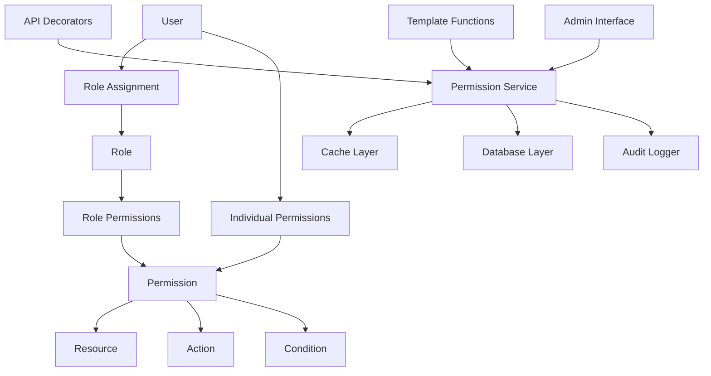

# Дизайн системы ролей и разрешений (RBAC)

## Обзор

Система ролей и разрешений (Role-Based Access Control) предназначена для обеспечения гибкого и безопасного управления доступом к ресурсам складского приложения. Система построена на принципах минимальных привилегий, разделения обязанностей и простоты администрирования.

### Ключевые принципы дизайна

1. **Гибкость**: Поддержка как ролевых, так и индивидуальных разрешений
2. **Производительность**: Кэширование разрешений для быстрой проверки
3. **Безопасность**: Защита от основных уязвимостей и атак
4. **Простота интеграции**: Легкое использование в API и шаблонах
5. **Расширяемость**: Возможность добавления новых ресурсов и действий
6. **Аудит**: Полное логирование изменений в системе безопасности

## Архитектура

### Компоненты системы



### Модель данных

#### Основные сущности

1. **User** - Пользователь системы (расширение существующей модели)
2. **Role** - Роль с набором разрешений
3. **Permission** - Разрешение на выполнение действия с ресурсом
4. **UserRole** - Связь пользователя с ролью
5. **UserPermission** - Индивидуальные разрешения пользователя
6. **PermissionAuditLog** - Журнал изменений разрешений

## Компоненты и интерфейсы

### 1. Модели данных (SQLModel)

#### Role Model
```python
class Role(SQLModel, table=True):
    __tablename__ = "roles"
    
    id: Optional[int] = Field(default=None, primary_key=True)
    name: str = Field(unique=True, max_length=100)
    description: Optional[str] = Field(default=None, max_length=500)
    is_system: bool = Field(default=False)  # Системные роли нельзя удалять
    created_at: datetime = Field(default_factory=datetime.utcnow)
    updated_at: Optional[datetime] = Field(default=None)
    
    # Relationships
    permissions: List["RolePermission"] = Relationship(back_populates="role")
    users: List["UserRole"] = Relationship(back_populates="role")
```

#### Permission Model
```python
class Permission(SQLModel, table=True):
    __tablename__ = "permissions"
    
    id: Optional[int] = Field(default=None, primary_key=True)
    resource: str = Field(max_length=100)  # products, warehouses, operations, etc.
    action: str = Field(max_length=100)    # create, read, update, delete, execute, manage
    condition: Optional[str] = Field(default=None, max_length=100)  # own_only, warehouse_specific, etc.
    description: Optional[str] = Field(default=None, max_length=500)
    
    __table_args__ = (UniqueConstraint("resource", "action", "condition"),)
```

#### UserRole Model
```python
class UserRole(SQLModel, table=True):
    __tablename__ = "user_roles"
    
    id: Optional[int] = Field(default=None, primary_key=True)
    user_id: int = Field(foreign_key="users.id", ondelete="CASCADE")
    role_id: int = Field(foreign_key="roles.id", ondelete="CASCADE")
    assigned_by: int = Field(foreign_key="users.id")
    assigned_at: datetime = Field(default_factory=datetime.utcnow)
    
    # Relationships
    user: "User" = Relationship(back_populates="roles")
    role: "Role" = Relationship(back_populates="users")
    assigned_by_user: "User" = Relationship()
```

#### UserPermission Model
```python
class UserPermission(SQLModel, table=True):
    __tablename__ = "user_permissions"
    
    id: Optional[int] = Field(default=None, primary_key=True)
    user_id: int = Field(foreign_key="users.id", ondelete="CASCADE")
    permission_id: int = Field(foreign_key="permissions.id", ondelete="CASCADE")
    granted: bool = Field(default=True)  # True = grant, False = deny
    context: Optional[Dict[str, Any]] = Field(default=None, sa_column=Column(JSON))
    warehouse_id: Optional[int] = Field(default=None, foreign_key="warehouses.id")  # Ограничение по складу
    assigned_by: int = Field(foreign_key="users.id")
    assigned_at: datetime = Field(default_factory=datetime.utcnow)
    expires_at: Optional[datetime] = Field(default=None)
    
    # Relationships
    user: "User" = Relationship(back_populates="individual_permissions")
    permission: "Permission" = Relationship()
    warehouse: Optional["Warehouse"] = Relationship()
    assigned_by_user: "User" = Relationship()
```

#### UserRoleWarehouse Model (для ролей на уровне склада)
```python
class UserRoleWarehouse(SQLModel, table=True):
    __tablename__ = "user_role_warehouses"
    
    id: Optional[int] = Field(default=None, primary_key=True)
    user_id: int = Field(foreign_key="users.id", ondelete="CASCADE")
    role_id: int = Field(foreign_key="roles.id", ondelete="CASCADE")
    warehouse_id: int = Field(foreign_key="warehouses.id", ondelete="CASCADE")
    assigned_by: int = Field(foreign_key="users.id")
    assigned_at: datetime = Field(default_factory=datetime.utcnow)
    
    # Relationships
    user: "User" = Relationship()
    role: "Role" = Relationship()
    warehouse: "Warehouse" = Relationship()
    assigned_by_user: "User" = Relationship()
    
    __table_args__ = (UniqueConstraint("user_id", "role_id", "warehouse_id"),)
```

### 2. Сервисы

#### PermissionService
```python
class PermissionService:
    def __init__(self, db: AsyncSession, cache: CacheService):
        self.db = db
        self.cache = cache
    
    async def has_permission(
        self, 
        user_id: int, 
        resource: str, 
        action: str, 
        context: Optional[Dict] = None,
        warehouse_id: Optional[int] = None
    ) -> bool:
        """Основной метод проверки разрешений с поддержкой складов"""
        
    async def has_warehouse_permission(
        self,
        user_id: int,
        warehouse_id: int,
        resource: str,
        action: str,
        context: Optional[Dict] = None
    ) -> bool:
        """Проверка разрешений для конкретного склада"""
        
    async def get_user_permissions(self, user_id: int) -> List[Permission]:
        """Получение всех разрешений пользователя"""
        
    async def grant_permission(
        self, 
        user_id: int, 
        permission_id: int, 
        granted_by: int,
        context: Optional[Dict] = None
    ) -> UserPermission:
        """Предоставление индивидуального разрешения"""
        
    async def revoke_permission(
        self, 
        user_id: int, 
        permission_id: int, 
        revoked_by: int
    ) -> bool:
        """Отзыв индивидуального разрешения"""
```

#### RoleService
```python
class RoleService:
    def __init__(self, db: AsyncSession, audit_service: AuditService):
        self.db = db
        self.audit_service = audit_service
    
    async def assign_role(self, user_id: int, role_id: int, assigned_by: int) -> UserRole:
        """Назначение глобальной роли пользователю"""
        
    async def assign_warehouse_role(
        self, 
        user_id: int, 
        role_id: int, 
        warehouse_id: int, 
        assigned_by: int
    ) -> UserRoleWarehouse:
        """Назначение роли пользователю для конкретного склада"""
        
    async def remove_role(self, user_id: int, role_id: int, removed_by: int) -> bool:
        """Удаление глобальной роли у пользователя"""
        
    async def remove_warehouse_role(
        self, 
        user_id: int, 
        role_id: int, 
        warehouse_id: int, 
        removed_by: int
    ) -> bool:
        """Удаление роли склада у пользователя"""
        
    async def create_role(self, role_data: RoleCreate, created_by: int) -> Role:
        """Создание новой роли"""
        
    async def add_permission_to_role(
        self, 
        role_id: int, 
        permission_id: int, 
        added_by: int
    ) -> RolePermission:
        """Добавление разрешения к роли"""
```

#### CacheService
```python
class CacheService:
    def __init__(self, redis_client: Redis):
        self.redis = redis_client
        self.ttl = 3600  # 1 час
    
    async def get_user_permissions(self, user_id: int) -> Optional[List[Dict]]:
        """Получение кэшированных разрешений пользователя"""
        
    async def set_user_permissions(self, user_id: int, permissions: List[Dict]) -> None:
        """Кэширование разрешений пользователя"""
        
    async def invalidate_user_cache(self, user_id: int) -> None:
        """Инвалидация кэша пользователя"""
        
    async def invalidate_role_cache(self, role_id: int) -> None:
        """Инвалидация кэша всех пользователей с данной ролью"""
```

### 3. API интеграция

#### Декораторы и зависимости
```python
def require_permission(resource: str, action: str, condition: Optional[str] = None):
    """Декоратор для защиты эндпоинтов"""
    def decorator(func):
        @wraps(func)
        async def wrapper(*args, **kwargs):
            # Логика проверки разрешений
            pass
        return wrapper
    return decorator

async def check_permission(
    resource: str,
    action: str, 
    condition: Optional[str] = None,
    context: Optional[Dict] = None,
    warehouse_id: Optional[int] = None,
    current_user: User = Depends(get_current_user),
    permission_service: PermissionService = Depends(get_permission_service)
) -> bool:
    """Dependency для проверки разрешений в эндпоинтах"""
    if warehouse_id:
        return await permission_service.has_warehouse_permission(
            current_user.id, warehouse_id, resource, action, context
        )
    return await permission_service.has_permission(
        current_user.id, resource, action, context, warehouse_id
    )

def require_warehouse_permission(resource: str, action: str):
    """Декоратор для защиты эндпоинтов с проверкой прав на склад"""
    def decorator(func):
        @wraps(func)
        async def wrapper(*args, **kwargs):
            # Извлекаем warehouse_id из параметров запроса
            warehouse_id = kwargs.get('warehouse_id') or kwargs.get('warehouse')
            if not warehouse_id:
                raise HTTPException(400, "Warehouse ID required")
            
            # Проверяем разрешение для склада
            current_user = kwargs.get('current_user')
            if not current_user:
                raise HTTPException(401, "Authentication required")
                
            permission_service = get_permission_service()
            has_access = await permission_service.has_warehouse_permission(
                current_user.id, warehouse_id, resource, action
            )
            
            if not has_access:
                raise HTTPException(403, f"Access denied to warehouse {warehouse_id}")
                
            return await func(*args, **kwargs)
        return wrapper
    return decorator
```

#### Примеры использования в API
```python
@router.post("/products/")
@require_permission("products", "create")
async def create_product(product_data: ProductCreate):
    # Логика создания продукта
    pass

@router.get("/products/{product_id}")
async def get_product(
    product_id: int,
    can_read: bool = Depends(
        lambda: check_permission("products", "read", context={"product_id": product_id})
    )
):
    if not can_read:
        raise HTTPException(status_code=403, detail="Access denied")
    # Логика получения продукта

@router.post("/warehouses/{warehouse_id}/operations")
@require_warehouse_permission("operations", "create")
async def create_warehouse_operation(
    warehouse_id: int,
    operation_data: OperationCreate,
    current_user: User = Depends(get_current_user)
):
    # Пользователь уже проверен декоратором на права к этому складу
    # Логика создания операции для склада

@router.get("/warehouses/{warehouse_id}/products")
async def get_warehouse_products(
    warehouse_id: int,
    current_user: User = Depends(get_current_user),
    can_read: bool = Depends(
        lambda warehouse_id=warehouse_id: check_permission(
            "products", "read", warehouse_id=warehouse_id
        )
    )
):
    if not can_read:
        raise HTTPException(status_code=403, detail="Access denied to warehouse")
    # Логика получения продуктов склада
```

### 4. Интеграция с шаблонами

#### Jinja2 функции
```python
def setup_template_functions(app: FastAPI):
    """Настройка глобальных функций для шаблонов"""
    
    @app.template_global()
    def has_permission(resource: str, action: str, condition: Optional[str] = None, warehouse_id: Optional[int] = None) -> bool:
        """Проверка разрешения в шаблоне"""
        user = get_current_user_from_context()
        if not user:
            return False
        return permission_service.has_permission_sync(user.id, resource, action, warehouse_id=warehouse_id)
    
    @app.template_global()
    def has_warehouse_permission(warehouse_id: int, resource: str, action: str) -> bool:
        """Проверка разрешения для конкретного склада в шаблоне"""
        user = get_current_user_from_context()
        if not user:
            return False
        return permission_service.has_warehouse_permission_sync(user.id, warehouse_id, resource, action)
    
    @app.template_global()
    def user_has_role(role_name: str, warehouse_id: Optional[int] = None) -> bool:
        """Проверка роли пользователя в шаблоне"""
        user = get_current_user_from_context()
        if not user:
            return False
        return role_service.user_has_role_sync(user.id, role_name, warehouse_id)
    
    @app.template_global()
    def get_user_warehouses() -> List[Dict]:
        """Получение списка складов, к которым у пользователя есть доступ"""
        user = get_current_user_from_context()
        if not user:
            return []
        return permission_service.get_user_warehouses_sync(user.id)
```

#### Примеры использования в шаблонах
```html
<!-- Показать кнопку создания только если есть разрешение -->

<button class="btn btn-primary">Создать продукт</button>


<!-- Проверка разрешения для конкретного склада -->

<button class="btn btn-success">Создать операцию</button>


<!-- Условное отображение меню -->

<li><a href="/warehouses">Управление складами</a></li>


<!-- Проверка роли -->

<li><a href="/admin">Администрирование</a></li>


<!-- Выпадающий список складов с проверкой доступа -->
<select name="warehouse_id" class="form-control">
    
        <option value="{{ warehouse.id }}">{{ warehouse.name }}</option>
    
</select>

<!-- Показать операции только для складов с доступом -->

    
    <div class="warehouse-section">
        <h3>{{ warehouse.name }}</h3>
        <!-- Операции склада -->
        
        <button onclick="createOperation({{ warehouse.id }})">Создать операцию</button>
        
    </div>
    

```

### 5. Административный интерфейс

#### Страницы администрирования
1. **Управление пользователями** (`/admin/users`)
   - Список пользователей с глобальными ролями
   - Назначение/удаление глобальных ролей
   - Добавление индивидуальных разрешений
   - Просмотр складских назначений пользователя

2. **Управление складскими назначениями** (`/admin/warehouse-assignments`)
   - Матрица пользователей и складов
   - Назначение ролей пользователям на конкретные склады
   - Массовое назначение ролей
   - Копирование назначений между складами

3. **Управление ролями** (`/admin/roles`)
   - Создание/редактирование ролей
   - Разделение на глобальные и складские роли
   - Назначение разрешений ролям
   - Просмотр пользователей с ролью

4. **Управление разрешениями** (`/admin/permissions`)
   - Список всех разрешений
   - Создание новых разрешений
   - Группировка по ресурсам и условиям
   - Просмотр использования разрешений

5. **Складская безопасность** (`/admin/warehouse-security`)
   - Отчет по доступу к складам
   - Пользователи без назначенных складов
   - Склады без назначенных пользователей
   - Матрица доступа по складам

6. **Аудит безопасности** (`/admin/security-audit`)
   - Логи изменений ролей и разрешений
   - Отчеты по доступу к складам
   - Статистика использования по складам
   - Попытки несанкционированного доступа

## Модели данных

### Схемы Pydantic

#### Role Schemas
```python
class RoleBase(BaseModel):
    name: str = Field(max_length=100)
    description: Optional[str] = Field(default=None, max_length=500)

class RoleCreate(RoleBase):
    permissions: Optional[List[int]] = Field(default=[])

class RoleUpdate(BaseModel):
    name: Optional[str] = Field(default=None, max_length=100)
    description: Optional[str] = Field(default=None, max_length=500)
    permissions: Optional[List[int]] = Field(default=None)

class Role(RoleBase):
    id: int
    is_system: bool
    created_at: datetime
    updated_at: Optional[datetime]
    
    class Config:
        from_attributes = True
```

#### Permission Schemas
```python
class PermissionBase(BaseModel):
    resource: str = Field(max_length=100)
    action: str = Field(max_length=100)
    condition: Optional[str] = Field(default=None, max_length=100)
    description: Optional[str] = Field(default=None, max_length=500)

class PermissionCreate(PermissionBase):
    pass

class Permission(PermissionBase):
    id: int
    
    class Config:
        from_attributes = True
```

#### User Extension Schemas
```python
class UserWithRoles(User):
    roles: List[Role] = Field(default=[])
    individual_permissions: List[Permission] = Field(default=[])
    effective_permissions: List[Permission] = Field(default=[])
```

### Предопределенные роли и разрешения

#### Системные роли
```python
SYSTEM_ROLES = {
    "Администратор": {
        "description": "Полный доступ ко всем функциям системы",
        "permissions": ["*:*"],  # Все разрешения
        "scope": "global"  # Глобальная роль
    },
    "Менеджер склада": {
        "description": "Управление складскими операциями и отчетами",
        "permissions": [
            "products:*", "warehouses:read", "warehouses:update", 
            "operations:*", "reports:read", "sync:read"
        ],
        "scope": "global"
    },
    "Менеджер конкретного склада": {
        "description": "Полное управление назначенным складом",
        "permissions": [
            "products:read:warehouse_only", "products:update:warehouse_only",
            "products:create", "warehouses:read:assigned_only", 
            "warehouses:update:assigned_only", "operations:*", 
            "reports:read", "users:read"
        ],
        "scope": "warehouse"  # Роль уровня склада
    },
    "Оператор склада": {
        "description": "Базовые операции с назначенным складом",
        "permissions": [
            "products:read:warehouse_only", "products:update:warehouse_only", 
            "warehouses:read:assigned_only", "operations:create", 
            "operations:read", "operations:update"
        ],
        "scope": "warehouse"
    },
    "Кладовщик": {
        "description": "Операции приемки и отгрузки на складе",
        "permissions": [
            "products:read:warehouse_only", "warehouses:read:assigned_only",
            "operations:create", "operations:read"
        ],
        "scope": "warehouse"
    },
    "Наблюдатель": {
        "description": "Только просмотр данных",
        "permissions": [
            "products:read", "warehouses:read", 
            "operations:read", "reports:read"
        ],
        "scope": "global"
    },
    "Наблюдатель склада": {
        "description": "Просмотр данных только назначенного склада",
        "permissions": [
            "products:read:warehouse_only", "warehouses:read:assigned_only",
            "operations:read", "reports:read"
        ],
        "scope": "warehouse"
    }
}
```

#### Системные разрешения
```python
SYSTEM_PERMISSIONS = [
    # Продукты
    ("products", "create", None, "Создание новых продуктов"),
    ("products", "read", None, "Просмотр продуктов"),
    ("products", "read", "own_only", "Просмотр только своих продуктов"),
    ("products", "read", "warehouse_only", "Просмотр продуктов только своих складов"),
    ("products", "update", None, "Редактирование продуктов"),
    ("products", "update", "warehouse_only", "Редактирование продуктов только своих складов"),
    ("products", "delete", None, "Удаление продуктов"),
    ("products", "manage", None, "Полное управление продуктами"),
    
    # Склады
    ("warehouses", "create", None, "Создание складов"),
    ("warehouses", "read", None, "Просмотр всех складов"),
    ("warehouses", "read", "assigned_only", "Просмотр только назначенных складов"),
    ("warehouses", "update", None, "Редактирование складов"),
    ("warehouses", "update", "assigned_only", "Редактирование только назначенных складов"),
    ("warehouses", "delete", None, "Удаление складов"),
    ("warehouses", "manage", None, "Полное управление складами"),
    ("warehouses", "assign", None, "Назначение пользователей на склады"),
    
    # Операции
    ("operations", "create", None, "Создание операций"),
    ("operations", "read", None, "Просмотр операций"),
    ("operations", "update", None, "Редактирование операций"),
    ("operations", "delete", None, "Удаление операций"),
    ("operations", "execute", None, "Выполнение операций"),
    
    # Пользователи
    ("users", "create", None, "Создание пользователей"),
    ("users", "read", None, "Просмотр пользователей"),
    ("users", "update", None, "Редактирование пользователей"),
    ("users", "delete", None, "Удаление пользователей"),
    ("users", "manage", None, "Управление ролями и разрешениями"),
    
    # Синхронизация
    ("sync", "read", None, "Просмотр статуса синхронизации"),
    ("sync", "execute", None, "Запуск синхронизации"),
    ("sync", "manage", None, "Управление настройками синхронизации"),
    
    # Отчеты
    ("reports", "read", None, "Просмотр отчетов"),
    ("reports", "create", None, "Создание отчетов"),
    ("reports", "export", None, "Экспорт отчетов"),
    
    # Администрирование
    ("admin", "access", None, "Доступ к админ-панели"),
    ("admin", "users", None, "Управление пользователями"),
    ("admin", "roles", None, "Управление ролями"),
    ("admin", "permissions", None, "Управление разрешениями"),
    ("admin", "audit", None, "Просмотр аудит-логов"),
]
```

## Обработка ошибок

### Типы ошибок
```python
class PermissionError(HTTPException):
    def __init__(self, detail: str = "Access denied"):
        super().__init__(status_code=403, detail=detail)

class RoleNotFoundError(HTTPException):
    def __init__(self, role_id: int):
        super().__init__(status_code=404, detail=f"Role {role_id} not found")

class PermissionNotFoundError(HTTPException):
    def __init__(self, permission_id: int):
        super().__init__(status_code=404, detail=f"Permission {permission_id} not found")

class InvalidPermissionError(HTTPException):
    def __init__(self, detail: str):
        super().__init__(status_code=400, detail=detail)
```

### Обработчики ошибок
```python
@app.exception_handler(PermissionError)
async def permission_error_handler(request: Request, exc: PermissionError):
    return JSONResponse(
        status_code=exc.status_code,
        content={"detail": exc.detail, "type": "permission_error"}
    )
```

## Стратегия тестирования

### Модульные тесты
1. **Тестирование моделей**
   - Валидация данных
   - Связи между моделями
   - Ограничения базы данных

2. **Тестирование сервисов**
   - Логика проверки разрешений
   - Кэширование
   - Аудит изменений

3. **Тестирование API**
   - Защита эндпоинтов
   - Правильные HTTP статусы
   - Валидация входных данных

### Интеграционные тесты
1. **Тестирование полного цикла**
   - Создание пользователя → назначение роли → проверка доступа
   - Изменение разрешений → инвалидация кэша → проверка новых прав

2. **Тестирование производительности**
   - Время отклика проверки разрешений
   - Нагрузочное тестирование кэша
   - Масштабируемость системы

### Тестирование безопасности
1. **Тестирование уязвимостей**
   - SQL-инъекции в параметрах разрешений
   - Попытки privilege escalation
   - Обход проверок разрешений

2. **Тестирование аудита**
   - Корректность логирования изменений
   - Целостность аудит-логов
   - Производительность при большом объеме логов

## Миграция и развертывание

### План миграции
1. **Фаза 1**: Создание новых таблиц и моделей
2. **Фаза 2**: Миграция существующих пользователей
3. **Фаза 3**: Обновление API эндпоинтов
4. **Фаза 4**: Обновление шаблонов
5. **Фаза 5**: Удаление устаревшего кода

### Примеры использования складских разрешений

#### Сценарий 1: Назначение менеджера склада
```python
# Пользователь получает роль "Менеджер конкретного склада" для склада ID=5
await role_service.assign_warehouse_role(
    user_id=123, 
    role_id=get_role_id("Менеджер конкретного склада"),
    warehouse_id=5,
    assigned_by=admin_user_id
)

# Теперь пользователь может управлять только складом ID=5
can_manage = await permission_service.has_warehouse_permission(
    user_id=123, warehouse_id=5, resource="operations", action="manage"
)  # True

can_manage_other = await permission_service.has_warehouse_permission(
    user_id=123, warehouse_id=7, resource="operations", action="manage"
)  # False
```

#### Сценарий 2: Оператор с доступом к нескольким складам
```python
# Назначаем оператора на два склада
await role_service.assign_warehouse_role(user_id=456, role_id=operator_role_id, warehouse_id=1, assigned_by=admin_id)
await role_service.assign_warehouse_role(user_id=456, role_id=operator_role_id, warehouse_id=3, assigned_by=admin_id)

# Получаем список складов пользователя
user_warehouses = await permission_service.get_user_warehouses(user_id=456)
# Результат: [{"id": 1, "name": "Основной склад"}, {"id": 3, "name": "Филиал"}]
```

#### Сценарий 3: Проверка в API эндпоинте
```python
@router.put("/warehouses/{warehouse_id}/products/{product_id}")
@require_warehouse_permission("products", "update")
async def update_warehouse_product(
    warehouse_id: int,
    product_id: int,
    product_data: ProductUpdate,
    current_user: User = Depends(get_current_user)
):
    # Пользователь автоматически проверен на права к warehouse_id
    # Можно безопасно обновлять продукт
    return await product_service.update_product(product_id, product_data)
```

### Скрипт миграции данных
```python
async def migrate_existing_users():
    """Миграция существующих пользователей на новую систему ролей"""
    # Создание системных ролей и разрешений
    await create_system_roles_and_permissions()
    
    # Назначение ролей существующим пользователям
    admin_users = await get_users_with_admin_flag()
    for user in admin_users:
        await role_service.assign_role(
            user.id, 
            get_role_id("Администратор"), 
            system_user_id
        )
    
    regular_users = await get_users_without_admin_flag()
    for user in regular_users:
        await role_service.assign_role(
            user.id, 
            get_role_id("Оператор склада"), 
            system_user_id
        )
    
    # Сохранение совместимости с is_admin
    # Поле остается, но используется только для обратной совместимости
```

### Мониторинг и метрики
1. **Метрики производительности**
   - Время отклика проверки разрешений
   - Процент попаданий в кэш
   - Количество проверок разрешений в секунду

2. **Метрики безопасности**
   - Количество отказов в доступе
   - Попытки несанкционированного доступа
   - Изменения в системе разрешений

3. **Метрики использования**
   - Наиболее часто проверяемые разрешения
   - Активность пользователей по ролям
   - Эффективность ролевой модели