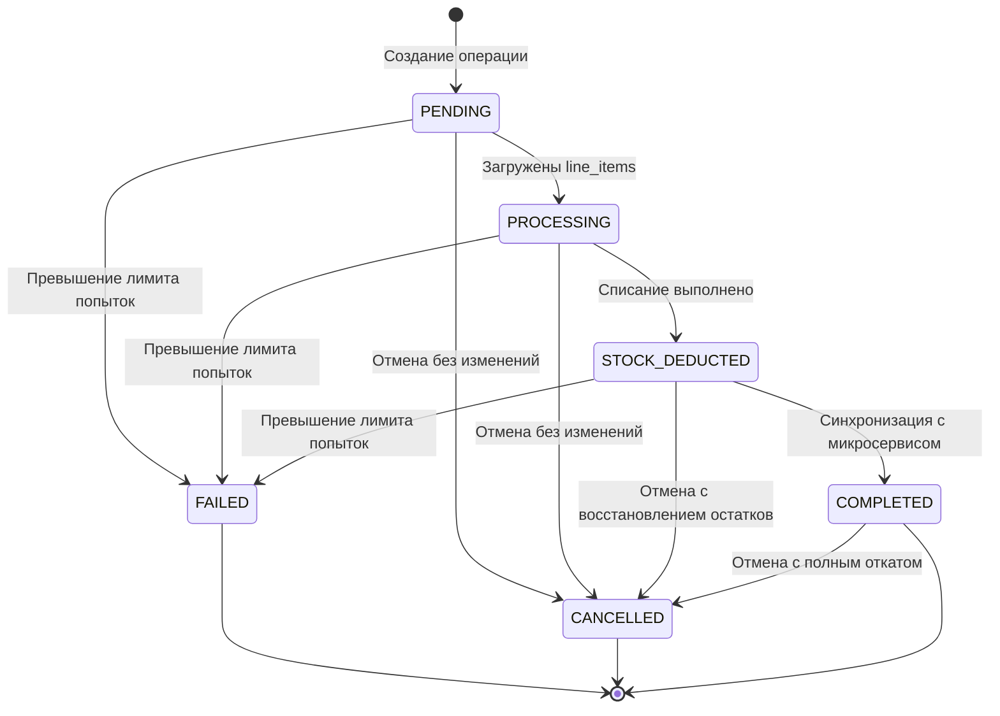
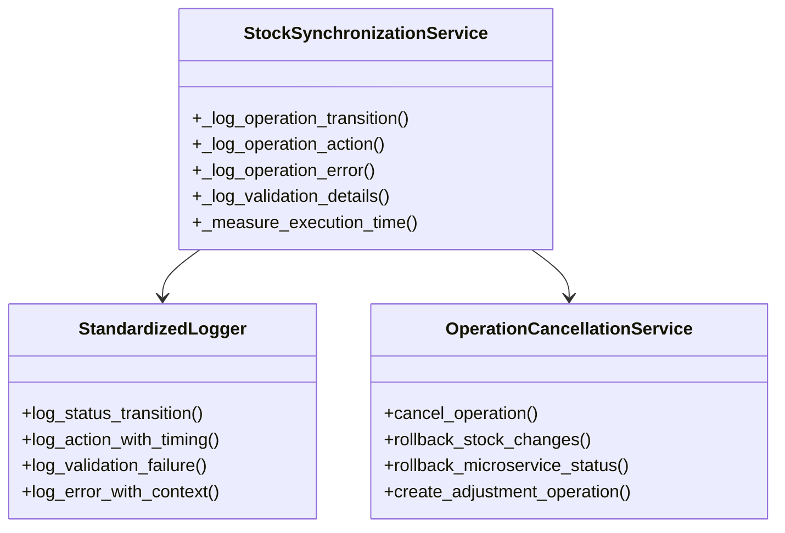

# Документ дизайна

## Обзор

Данный дизайн описывает рефакторинг сервиса синхронизации складских остатков для стандартизации логирования и улучшения управления жизненным циклом статусов операций. Основные изменения включают:

1. Добавление нового статуса STOCK_DEDUCTED для четкого разделения этапов обработки
2. Стандартизацию системы логирования через централизованные методы
3. Реализацию полноценной системы отмены операций с откатом изменений
4. Улучшение логики переходов между статусами

## Архитектура

### Жизненный цикл статусов операций



### Компоненты системы логирования



## Компоненты и интерфейсы

### 1. Обновленная модель OperationStatus

```python
class OperationStatus(str, Enum):
    """Статусы операций синхронизации."""
    PENDING = "pending"           # Создана, ожидает загрузки line_items
    PROCESSING = "processing"     # Line_items загружены, готова к списанию
    STOCK_DEDUCTED = "stock_deducted"  # Остатки списаны, ожидает синхронизации
    COMPLETED = "completed"       # Полностью завершена
    FAILED = "failed"            # Превышен лимит попыток
    CANCELLED = "cancelled"       # Отменена пользователем
```

### 2. Стандартизированная система логирования

```python
class StandardizedLogger:
    """Централизованная система логирования для операций синхронизации."""
    
    def log_status_transition(
        self, 
        operation_id: UUID, 
        from_status: OperationStatus, 
        to_status: OperationStatus, 
        reason: str,
        additional_context: Optional[Dict] = None
    ):
        """Логирование переходов между статусами."""
        
    def log_action_with_timing(
        self, 
        operation_id: UUID, 
        action: str, 
        details: str,
        execution_time_ms: Optional[int] = None,
        status: str = "info"
    ):
        """Логирование действий с измерением времени выполнения."""
        
    def log_validation_failure(
        self, 
        operation_id: UUID, 
        validation_result: ValidationResult
    ):
        """Стандартизированное логирование ошибок валидации."""
        
    def log_error_with_context(
        self, 
        operation_id: UUID, 
        error: Exception, 
        context: Dict[str, Any]
    ):
        """Логирование ошибок с контекстной информацией."""
```

### 3. Сервис отмены операций

```python
class OperationCancellationService:
    """Сервис для отмены операций и отката изменений."""
    
    def cancel_operation(self, operation_id: UUID) -> CancellationResult:
        """Основной метод отмены операции."""
        
    def _rollback_stock_changes(self, operation: PendingStockOperation) -> bool:
        """Откат изменений остатков на складе."""
        
    def _rollback_microservice_status(self, operation: PendingStockOperation) -> bool:
        """Откат статуса в микросервисе."""
        
    def _create_adjustment_operation(
        self, 
        operation: PendingStockOperation, 
        adjustment_type: str
    ) -> Optional[UUID]:
        """Создание операции корректировки для отката."""
```

## Модели данных

### Обновленная модель PendingStockOperation

Добавляются новые поля для отслеживания этапов обработки:

```python
class PendingStockOperation(SQLModel, table=True):
    # ... существующие поля ...
    
    # Новые поля для отслеживания этапов
    line_items_loaded_at: Optional[datetime] = Field(default=None)
    stock_deducted_at: Optional[datetime] = Field(default=None)
    microservice_synced_at: Optional[datetime] = Field(default=None)
    
    # Поля для отмены операций
    cancelled_by: Optional[str] = Field(default=None)
    cancellation_reason: Optional[str] = Field(default=None)
    rollback_operations: Optional[List[UUID]] = Field(default=None, sa_column=Column(JSON))
```

### Стандартизированные действия логирования

```python
class LogAction(str, Enum):
    """Стандартизированные действия для логирования."""
    # Создание и инициализация
    OPERATION_CREATED = "operation_created"
    ACCOUNT_NAME_UPDATED = "account_name_updated"
    
    # Загрузка данных
    LINE_ITEMS_LOADING = "line_items_loading"
    LINE_ITEMS_LOADED = "line_items_loaded"
    LINE_ITEMS_LOAD_FAILED = "line_items_load_failed"
    
    # Валидация остатков
    STOCK_VALIDATION_STARTED = "stock_validation_started"
    STOCK_VALIDATION_PASSED = "stock_validation_passed"
    STOCK_VALIDATION_FAILED = "stock_validation_failed"
    
    # Списание остатков
    STOCK_DEDUCTION_STARTED = "stock_deduction_started"
    STOCK_DEDUCTION_COMPLETED = "stock_deduction_completed"
    STOCK_DEDUCTION_FAILED = "stock_deduction_failed"
    
    # Синхронизация с микросервисом
    MICROSERVICE_SYNC_STARTED = "microservice_sync_started"
    MICROSERVICE_SYNC_SUCCESS = "microservice_sync_success"
    MICROSERVICE_SYNC_FAILED = "microservice_sync_failed"
    
    # Переходы статусов
    STATUS_TRANSITION = "status_transition"
    
    # Отмена операций
    CANCELLATION_REQUESTED = "cancellation_requested"
    STOCK_ROLLBACK_STARTED = "stock_rollback_started"
    STOCK_ROLLBACK_COMPLETED = "stock_rollback_completed"
    MICROSERVICE_ROLLBACK_STARTED = "microservice_rollback_started"
    MICROSERVICE_ROLLBACK_COMPLETED = "microservice_rollback_completed"
    CANCELLATION_COMPLETED = "cancellation_completed"
    
    # Обработка ошибок
    RETRY_SCHEDULED = "retry_scheduled"
    MAX_RETRIES_REACHED = "max_retries_reached"
    OPERATION_FAILED = "operation_failed"
```

## Обработка ошибок

### Стратегия обработки ошибок по статусам

1. **PENDING статус:**
   - Ошибки загрузки line_items → retry с exponential backoff
   - Ошибки проверки статуса заказа → retry
   - Превышение лимита попыток → переход в FAILED

2. **PROCESSING статус:**
   - Ошибки валидации остатков → уведомление + retry
   - Ошибки списания → retry с exponential backoff
   - Превышение лимита попыток → переход в FAILED

3. **STOCK_DEDUCTED статус:**
   - Ошибки синхронизации с микросервисом → retry
   - Превышение лимита попыток → переход в FAILED (остатки остаются списанными)

### Логирование ошибок

Все ошибки логируются с контекстной информацией:
- ID операции и заказа
- Текущий статус операции
- Количество попыток
- Детали ошибки
- Время следующей попытки

## Стратегия тестирования

### Unit тесты

1. **Тестирование переходов статусов:**
   - Корректные переходы между всеми статусами
   - Некорректные переходы должны вызывать исключения
   - Логирование всех переходов

2. **Тестирование системы логирования:**
   - Стандартизированные форматы логов
   - Корректное измерение времени выполнения
   - Структурированное логирование валидации

3. **Тестирование отмены операций:**
   - Отмена на каждом этапе жизненного цикла
   - Корректный откат изменений остатков
   - Откат статуса в микросервисе

### Integration тесты

1. **Полный жизненный цикл операции:**
   - От создания до завершения
   - Обработка всех возможных сценариев ошибок
   - Корректная работа retry механизма

2. **Тестирование с реальными микросервисами:**
   - Интеграция с Allegro микросервисом
   - Обработка сетевых ошибок
   - Тестирование таймаутов

### Мониторинг и алерты

1. **Метрики для мониторинга:**
   - Количество операций в каждом статусе
   - Среднее время обработки операций
   - Частота ошибок по типам
   - Количество отмененных операций

2. **Алерты:**
   - Застрявшие операции (долго в одном статусе)
   - Высокий процент ошибок
   - Превышение времени обработки
   - Частые отмены операций