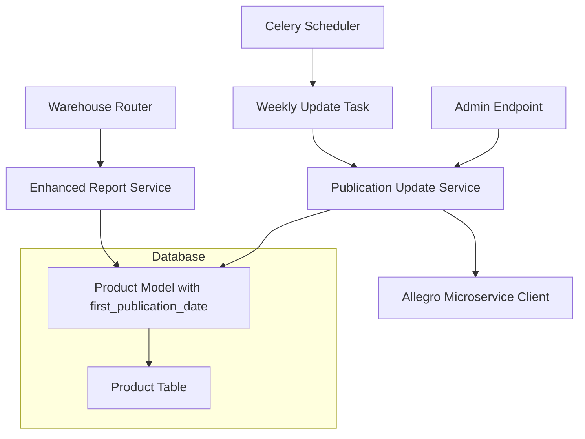

# Дизайн улучшения отчетов склада

## Обзор

Система будет расширена для включения информации о дате первого публикования офферт Allegro в отчеты склада. Данные будут храниться в поле базы данных товара и обновляться через периодическую еженедельную задачу Celery и ручной эндпоинт администратора.

## Архитектура

### Компоненты системы



### Поток данных

1. **Обновление данных о публикации**:
   - Еженедельная Celery задача запускается автоматически
   - Или администратор вызывает ручной эндпоинт
   - Система получает все SKU из базы данных
   - Батчевая обработка по 100 SKU через микросервисные API
   - Обновление поля first_publication_date в таблице Product

2. **Генерация отчетов**:
   - Пользователь запрашивает отчет (любого размера)
   - Система читает данные из базы (включая first_publication_date)
   - Для товаров с NULL в first_publication_date - точечные API запросы
   - Сохранение полученных данных в базу для будущих отчетов
   - Генерация и возврат готового отчета через StreamingResponse

## Компоненты и интерфейсы

### 1. Publication Update Service

```python
class PublicationUpdateService:
    """Сервис для обновления данных о публикации офферт в базе данных"""
    
    async def update_all_products_publication_dates(self) -> Dict[str, int]:
        """Обновляет данные о публикации для всех товаров в базе"""
        pass
    
    async def update_specific_products_publication_dates(
        self, 
        skus: List[str]
    ) -> Dict[str, int]:
        """Обновляет данные о публикации для указанных SKU"""
        pass
    
    async def get_publication_dates_batch(
        self, 
        skus: List[str], 
        batch_size: int = 100
    ) -> Dict[str, Optional[datetime]]:
        """Получает данные о публикации батчами через микросервис"""
        pass
    
    def _process_offers_response(
        self, 
        offers_data: List[Dict]
    ) -> Dict[str, datetime]:
        """Обрабатывает ответ микросервиса и извлекает даты публикации"""
        pass
    
    async def _save_publication_dates_to_db(
        self, 
        publication_data: Dict[str, Optional[datetime]]
    ):
        """Сохраняет данные о публикации в базу данных"""
        pass
```

### 2. Enhanced Report Service и новые эндпоинты

```python
# Новый эндпоинт в warehouse.py
@router.post('/update-publication-dates/')
async def update_publication_dates(
    skus: Optional[List[str]] = None,
    current_user: User = Depends(deps.get_current_admin_user)
) -> Dict[str, Any]:
    """Ручное обновление данных о публикации для всех товаров или указанных SKU"""
    pass

class EnhancedReportService:
    """Расширенный сервис генерации отчетов с данными о публикации"""
    
    async def generate_report_with_publications(
        self,
        skus: Optional[List[str]] = None,
        include_images: bool = True
    ) -> StreamingResponse:
        """Генерация отчета с автоматическим получением недостающих данных о публикации"""
        pass
    
    async def _get_missing_publication_dates(
        self, 
        skus_without_dates: List[str]
    ) -> Dict[str, Optional[datetime]]:
        """Получает данные о публикации для товаров без этой информации в базе"""
        pass
    
    async def _save_publication_dates_to_products(
        self, 
        publication_data: Dict[str, Optional[datetime]]
    ):
        """Сохраняет полученные данные о публикации в таблицу Product"""
        pass
```

### 3. Celery Tasks

```python
@celery.task(name="update_all_publication_dates")
def update_all_publication_dates_task():
    """Еженедельная задача для обновления данных о публикации всех товаров"""
    pass

@celery.task(name="update_specific_publication_dates") 
def update_specific_publication_dates_task(skus: List[str]):
    """Задача для обновления данных о публикации конкретных товаров"""
    pass
```

## Модели данных

### Расширение существующих моделей

```python
# Добавление поля в модель Product
class Product(SQLModel, table=True):
    # ... существующие поля ...
    first_publication_date: Optional[datetime] = Field(default=None, description="Дата первой публикации офферты на Allegro")

# Расширение InventoryManager
class InventoryManager:
    def get_stock_report_with_publications(
        self, 
        skus: Optional[List[str]] = None
    ) -> Tuple[pd.DataFrame, List[bytes]]:
        """Возвращает отчет с данными о публикации из базы данных"""
        pass
```

### Новые модели

```python
class PublicationUpdateRequest(BaseModel):
    skus: Optional[List[str]] = None  # Если None - обновить все товары

class PublicationUpdateResponse(BaseModel):
    status: str  # 'started', 'completed', 'already_running'
    total_products: int
    updated_products: int
    skipped_products: int
    errors: List[str]
    
class PublicationDateResponse(BaseModel):
    sku: str
    first_publication_date: Optional[datetime]
    offer_count: int
```

## Обработка ошибок

### Стратегии обработки ошибок

1. **API недоступен**: Пропустить обновление для недоступных товаров, продолжить с остальными
2. **Таймаут запроса**: Exponential backoff с максимум 3 попытками
3. **Rate limiting**: Задержка между батчами
4. **Дублирование задач**: Проверка на уже выполняющиеся задачи обновления

### Логирование

```python
class PublicationLogger:
    def log_batch_processing(self, batch_number: int, sku_count: int)
    def log_api_error(self, error: Exception, sku_batch: List[str])
    def log_update_completion(self, total_updated: int, total_errors: int)
    def log_database_operation(self, operation: str, sku_count: int)
```

## Стратегия тестирования

### Unit тесты

1. **PublicationUpdateService**:
   - Тестирование батчевой обработки
   - Обработка ошибок API
   - Парсинг ответов микросервиса
   - Сохранение данных в базу

2. **EnhancedReportService**:
   - Генерация отчетов с данными из базы
   - Точечное получение недостающих данных
   - Обработка товаров без данных о публикации

3. **Celery Tasks**:
   - Еженедельная задача обновления
   - Ручная задача обновления
   - Обработка ошибок в фоновых задачах

### Integration тесты

1. **End-to-end обновление данных**:
   - Полное обновление всех товаров
   - Частичное обновление по списку SKU
   - Обработка ошибок микросервиса

2. **Генерация отчетов**:
   - Отчеты с полными данными из базы
   - Отчеты с точечным получением недостающих данных
   - Обработка больших объемов данных

### Performance тесты

1. **Нагрузочное тестирование**:
   - Обновление данных для 1000+ товаров
   - Генерация отчетов с большим количеством товаров
   - Производительность базы данных при частых обновлениях

## Безопасность

### Авторизация эндпоинтов

```python
async def get_current_admin_user(current_user: User = Depends(deps.get_current_user)):
    """Проверка прав администратора для ручного обновления данных"""
    if not current_user.is_admin:
        raise HTTPException(status_code=403, detail="Требуются права администратора")
    return current_user
```

### Rate Limiting

```python
class PublicationUpdateLimiter:
    """Ограничение частоты обновления данных о публикации"""
    
    def __init__(self):
        self.running_tasks: Set[str] = set()
    
    def can_start_update(self, task_type: str) -> bool:
        """Проверяет, можно ли запустить задачу обновления"""
        return task_type not in self.running_tasks
    
    def mark_task_running(self, task_type: str):
        self.running_tasks.add(task_type)
    
    def mark_task_completed(self, task_type: str):
        self.running_tasks.discard(task_type)
```

## Производительность

### Оптимизации

1. **Батчевая обработка**: Группировка SKU по 100 штук для API запросов
2. **Хранение в базе**: Данные о публикации хранятся в поле Product для быстрого доступа
3. **Асинхронность**: Celery задачи для периодического обновления данных
4. **Точечные запросы**: Получение данных только для товаров без информации о публикации

### Мониторинг

```python
class PublicationMetrics:
    """Метрики производительности обновления данных о публикации"""
    
    def track_update_duration(self, sku_count: int, duration: float)
    def track_api_response_time(self, batch_size: int, duration: float)
    def track_database_operations(self, operation_type: str, count: int)
    def track_missing_data_requests(self, sku_count: int)
```

### Масштабирование

1. **Горизонтальное масштабирование**: Поддержка множественных Celery воркеров
2. **Индексирование базы данных**: Индексы на поле first_publication_date для быстрых запросов
3. **Партиционирование обновлений**: Разделение больших задач обновления на меньшие батчи