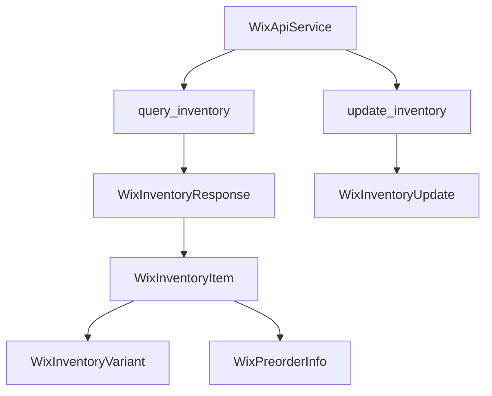

## Модели данных

### Модели для работы с инвентарем Wix

#### WixInventoryVariant
Модель варианта товара в инвентаре
- `variant_id` (str): ID варианта товара
- `in_stock` (bool): Наличие товара
- `quantity` (Optional[int]): Количество товара
- `available_for_preorder` (Optional[bool]): Доступность для предзаказа

#### WixPreorderInfo
Модель информации о предзаказе
- `enabled` (bool): Включен ли предзаказ
- `message` (Optional[str]): Сообщение о предзаказе

#### WixInventoryItem
Модель элемента инвентаря
- `id` (str): ID элемента инвентаря
- `external_id` (Optional[str]): Внешний ID
- `product_id` (str): ID товара
- `track_quantity` (bool): Отслеживание количества
- `variants` (List[WixInventoryVariant]): Список вариантов товара
- `last_updated` (datetime): Время последнего обновления
- `numeric_id` (str): Числовой ID
- `preorder_info` (WixPreorderInfo): Информация о предзаказе

#### WixInventoryMetadata
Модель метаданных инвентаря
- `items` (int): Количество элементов
- `offset` (int): Смещение для пагинации

#### WixInventoryResponse
Модель ответа API инвентаря
- `inventory_items` (List[WixInventoryItem]): Список элементов инвентаря
- `metadata` (WixInventoryMetadata): Метаданные
- `total_results` (int): Общее количество результатов

#### WixInventoryQuery
Модель запроса инвентаря
- `filter` (Optional[str]): Строка фильтрации
- `sort` (Optional[str]): Строка сортировки
- `paging` (Optional[Dict[str, int]]): Параметры пагинации

## API Методы

### Работа с инвентарем Wix

#### query_inventory
```python
def query_inventory(
    self,
    product_ids: Optional[List[str]] = None,
    filter_str: Optional[str] = None,
    sort_str: Optional[str] = None,
    limit: int = 100,
    offset: int = 0
) -> WixInventoryResponse
```
Получение информации об инвентаре товаров

Параметры:
- `product_ids`: Список ID товаров для фильтрации
- `filter_str`: Строка фильтрации в формате JSON
- `sort_str`: Строка сортировки
- `limit`: Количество элементов на странице (по умолчанию 100)
- `offset`: Смещение для пагинации (по умолчанию 0)

Возвращает:
- `WixInventoryResponse`: Ответ API с информацией об инвентаре

Пример использования:
```python
inventory = service.query_inventory(
    product_ids=["product_id_1", "product_id_2"],
    limit=10,
    offset=0
)
```

#### update_inventory
```python
def update_inventory(
    self,
    updates: List[WixInventoryUpdate],
    increment: bool = True
) -> None
```
Обновление количества товаров в инвентаре

Параметры:
- `updates`: Список обновлений инвентаря
- `increment`: Флаг увеличения/уменьшения количества (True - увеличение, False - уменьшение)

Пример использования:
```python
updates = [
    WixInventoryUpdate(
        inventory_item_id="product_id",
        quantity=2,
        variant_id="variant_id"
    )
]
service.update_inventory(updates, increment=True)
```

## Диаграмма взаимодействия компонентов



## Процесс обновления инвентаря

1. Получение текущего состояния инвентаря:
   - Запрос информации о товарах через `query_inventory`
   - Получение актуальных variant_id для каждого товара

2. Подготовка обновлений:
   - Формирование списка обновлений с учетом variant_id
   - Определение типа обновления (увеличение/уменьшение)

3. Применение обновлений:
   - Отправка запроса на обновление через `update_inventory`
   - Обработка ответа и возможных ошибок

## Обработка ошибок

При работе с инвентарем могут возникать следующие ошибки:
- `WixApiError`: Общая ошибка API
  - Неверный формат данных
  - Ошибки аутентификации
  - Ошибки сети
- Ошибки валидации данных:
  - Отсутствие обязательных полей
  - Неверный формат variant_id
  - Некорректные значения quantity

## Рекомендации по использованию

1. Всегда проверяйте наличие variant_id перед обновлением стока
2. Используйте пагинацию при работе с большими списками товаров
3. Обрабатывайте все возможные ошибки API
4. Ведите логирование операций с инвентарем
5. Используйте транзакции при массовых обновлениях

## API Сервисы

### Wix API Service

Сервис для работы с API Wix, реализующий основные операции с товарами и инвентарем.

#### Основные возможности

1. Работа с товарами:
   - Получение всех товаров с поддержкой фильтрации
   - Поиск товаров по SKU
   - Обновление данных товаров
   - Поддержка вариантов товаров

2. Работа с инвентарем:
   - Получение всех инвентарей с поддержкой фильтрации
   - Обновление количества товаров
   - Отслеживание стока
   - Поддержка предзаказов

3. Фильтрация и поиск:
   - Фильтрация по SKU
   - Фильтрация по ID товаров
   - Фильтрация по статусу видимости
   - Фильтрация по типу товара
   - Поддержка пользовательских фильтров

4. Обработка данных:
   - Валидация данных через модели SQLModel
   - Автоматическая обработка алиасов полей
   - Поддержка постраничной загрузки
   - Обработка ошибок API

#### Модели данных

1. Товары:
   ```python
   class WixProductAPI(SQLModel):
       id: str
       name: str
       sku: Optional[str]
       visible: bool
       product_type: ProductType
       # ... другие поля
   ```

2. Инвентарь:
   ```python
   class WixInventoryItem(SQLModel):
       id: str
       product_id: str
       track_quantity: bool
       variants: List[WixInventoryVariant]
       # ... другие поля
   ```

3. Фильтры:
   ```python
   class WixProductFilter(SQLModel):
       sku_list: Optional[List[str]]
       product_ids: Optional[List[str]]
       visible: Optional[bool]
       # ... другие поля

   class WixInventoryFilter(SQLModel):
       product_ids: Optional[List[str]]
       sort: Optional[str]
       # ... другие поля
   ```

#### Примеры использования

1. Получение товаров с фильтрацией:
   ```python
   filter_data = WixProductFilter(
       sku_list=["SKU001", "SKU002"],
       visible=True,
       product_type=ProductType.PHYSICAL
   )
   products = service.get_all_products(filter_data=filter_data)
   ```

2. Получение инвентаря:
   ```python
   filter_data = WixInventoryFilter(
       product_ids=["product1", "product2"]
   )
   inventory = service.get_all_inventory_items(filter_data=filter_data)
   ```

#### Ограничения API

1. Лимиты запросов:
   - Максимум 100 товаров на страницу
   - Максимум 100 инвентарей на страницу
   - Автоматическая обработка пагинации

2. Валидация данных:
   - Строгая типизация через SQLModel
   - Проверка обязательных полей
   - Обработка алиасов полей
   - Валидация вложенных объектов

3. Обработка ошибок:
   - Детальное логирование
   - Сохранение частично валидных данных
   - Информативные сообщения об ошибках 