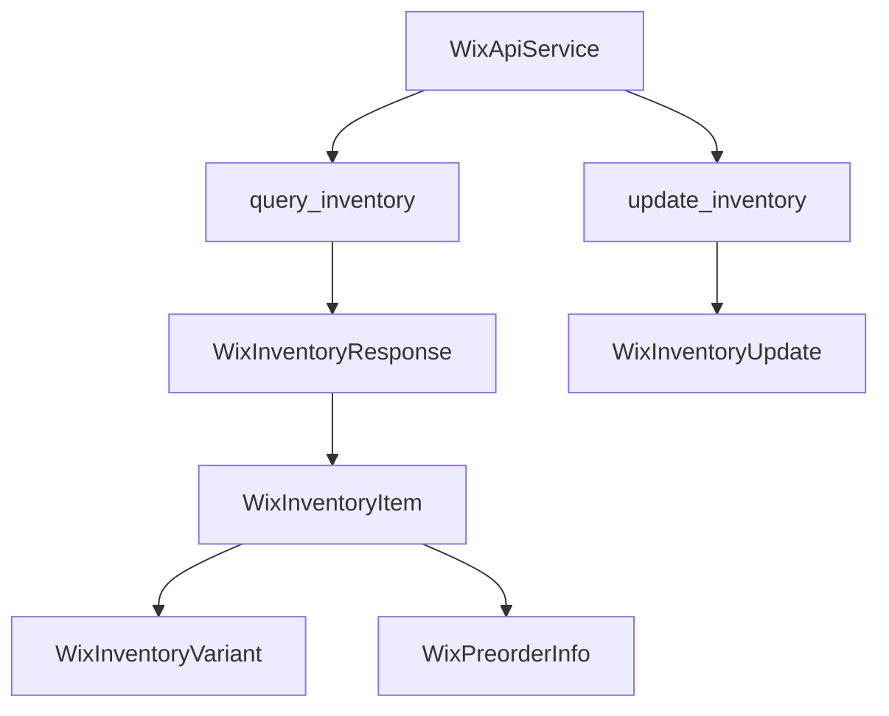
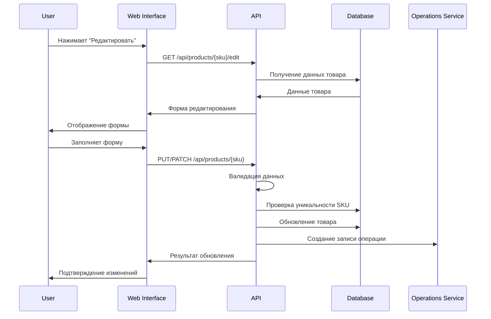
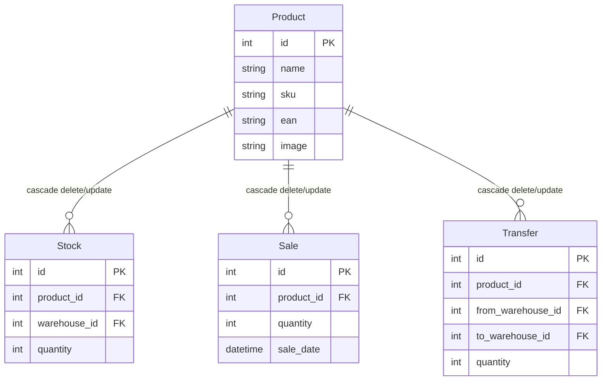
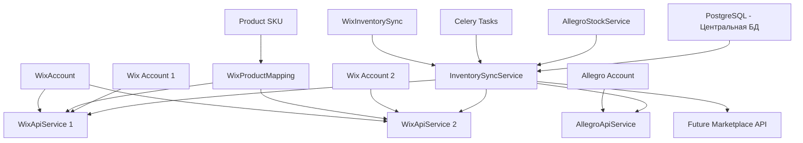
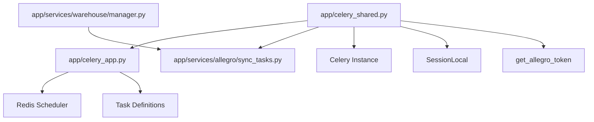

# Проект: BaseLinker to Wix

## Система синхронизации остатков товаров с Allegro

### Обзор
Система автоматической синхронизации остатков товаров между локальной базой данных и офферами на всех аккаунтах Allegro. Обеспечивает актуальные данные о наличии товаров на маркетплейсе при изменении остатков на складе.

### Архитектура
Многоуровневая система Celery задач с rate limiting, обработкой ошибок и механизмом блокировок (локов):

1. **Основная задача**: `sync_allegro_stock_all_accounts` - координирует синхронизацию
2. **Аккаунт-задача**: `sync_allegro_stock_single_account` - обрабатывает один аккаунт
3. **Батч-задача**: `sync_allegro_offers_batch` - обрабатывает группу товаров
4. **Единичная задача**: `update_single_allegro_offer` - обновляет конкретный оффер
5. **Механизм блокировок**: `ProductSyncLock` и утилиты для защиты от дублирующихся обновлений по SKU

### Технические требования
- **Rate Limiting**: 9000 запросов/минуту на Client ID (лимит API Allegro)
- **Batch Processing**: До 100 SKU в одном запросе получения офферов
- **Retry Strategy**: Экспоненциальный backoff (3-5 попыток)
- **Уведомления**: Telegram-боты для критических ошибок
- **Мониторинг**: Детальное логирование и метрики
- **Блокировки**: Исключение одновременного обновления одного SKU через таблицу ProductSyncLock

### Механизм блокировок (локов)
- Для каждого SKU при попытке обновления создаётся или обновляется запись в таблице ProductSyncLock
- Если лок активен (in_progress, не устарел) — обновление не запускается
- После завершения обновления лок снимается с нужным статусом (success/error)
- Для управления локами используются функции:
  - `acquire_product_sync_lock(sku, owner)`
  - `release_product_sync_lock(sku, owner, status, error=None)`
  - `is_product_locked(sku)`

### Текущий статус задачи
- [x] Реализован пайплайн Celery задач для массовой синхронизации
- [x] Добавлен rate limiter для соблюдения лимитов API Allegro
- [x] Реализована система уведомлений об ошибках в Telegram
- [x] Добавлено детальное логирование и мониторинг
- [x] Добавлен булевый флаг is_sync_enabled в модель товара и миграция
- [ ] Обновление бизнес-логики синхронизации: сначала is_sync_enabled, затем логи с локами (**в процессе**)
- [ ] Реализация и интеграция механизма блокировок (локов) для защиты от дублирующихся обновлений по SKU (**в процессе**)
- [ ] Кнопка в UI карточки товара для ручного включения/отключения синхронизации (**запланировано**)
- [ ] Интеграция задачи в планировщик Celery Beat (**запланировано**)

---

## Модели данных

### Модели для работы с инвентарем Wix

#### WixInventoryVariant
Модель варианта товара в инвентаре
- `variant_id` (str): ID варианта товара
- `in_stock` (bool): Наличие товара
- `quantity` (Optional[int]): Количество товара
- `available_for_preorder` (Optional[bool]): Доступность для предзаказа

#### WixPreorderInfo
Модель информации о предзаказе
- `enabled` (bool): Включен ли предзаказ
- `message` (Optional[str]): Сообщение о предзаказе

#### WixInventoryItem
Модель элемента инвентаря
- `id` (str): ID элемента инвентаря
- `external_id` (Optional[str]): Внешний ID
- `product_id` (str): ID товара
- `track_quantity` (bool): Отслеживание количества
- `variants` (List[WixInventoryVariant]): Список вариантов товара
- `last_updated` (datetime): Время последнего обновления
- `numeric_id` (str): Числовой ID
- `preorder_info` (WixPreorderInfo): Информация о предзаказе

#### WixInventoryMetadata
Модель метаданных инвентаря
- `items` (int): Количество элементов
- `offset` (int): Смещение для пагинации

#### WixInventoryResponse
Модель ответа API инвентаря
- `inventory_items` (List[WixInventoryItem]): Список элементов инвентаря
- `metadata` (WixInventoryMetadata): Метаданные
- `total_results` (int): Общее количество результатов

#### WixInventoryQuery
Модель запроса инвентаря
- `filter` (Optional[str]): Строка фильтрации
- `sort` (Optional[str]): Строка сортировки
- `paging` (Optional[Dict[str, int]]): Параметры пагинации

## API Методы

### Работа с инвентарем Wix

#### query_inventory
```python
def query_inventory(
    self,
    product_ids: Optional[List[str]] = None,
    filter_str: Optional[str] = None,
    sort_str: Optional[str] = None,
    limit: int = 100,
    offset: int = 0
) -> WixInventoryResponse
```
Получение информации об инвентаре товаров

Параметры:
- `product_ids`: Список ID товаров для фильтрации
- `filter_str`: Строка фильтрации в формате JSON
- `sort_str`: Строка сортировки
- `limit`: Количество элементов на странице (по умолчанию 100)
- `offset`: Смещение для пагинации (по умолчанию 0)

Возвращает:
- `WixInventoryResponse`: Ответ API с информацией об инвентаре

Пример использования:
```python
inventory = service.query_inventory(
    product_ids=["product_id_1", "product_id_2"],
    limit=10,
    offset=0
)
```

#### update_inventory
```python
def update_inventory(
    self,
    updates: List[WixInventoryUpdate],
    increment: bool = True
) -> None
```
Обновление количества товаров в инвентаре

Параметры:
- `updates`: Список обновлений инвентаря
- `increment`: Флаг увеличения/уменьшения количества (True - увеличение, False - уменьшение)

Пример использования:
```python
updates = [
    WixInventoryUpdate(
        inventory_item_id="product_id",
        quantity=2,
        variant_id="variant_id"
    )
]
service.update_inventory(updates, increment=True)
```

## Диаграмма взаимодействия компонентов



## Процесс обновления инвентаря

1. Получение текущего состояния инвентаря:
   - Запрос информации о товарах через `query_inventory`
   - Получение актуальных variant_id для каждого товара

2. Подготовка обновлений:
   - Формирование списка обновлений с учетом variant_id
   - Определение типа обновления (увеличение/уменьшение)

3. Применение обновлений:
   - Отправка запроса на обновление через `update_inventory`
   - Обработка ответа и возможных ошибок

## Обработка ошибок

При работе с инвентарем могут возникать следующие ошибки:
- `WixApiError`: Общая ошибка API
  - Неверный формат данных
  - Ошибки аутентификации
  - Ошибки сети
- Ошибки валидации данных:
  - Отсутствие обязательных полей
  - Неверный формат variant_id
  - Некорректные значения quantity

## Рекомендации по использованию

1. Всегда проверяйте наличие variant_id перед обновлением стока
2. Используйте пагинацию при работе с большими списками товаров
3. Обрабатывайте все возможные ошибки API
4. Ведите логирование операций с инвентарем
5. Используйте транзакции при массовых обновлениях

## API Сервисы

### Wix API Service

Сервис для работы с API Wix, реализующий основные операции с товарами и инвентарем.

#### Основные возможности

1. Работа с товарами:
   - Получение всех товаров с поддержкой фильтрации
   - Поиск товаров по SKU
   - Обновление данных товаров
   - Поддержка вариантов товаров

2. Работа с инвентарем:
   - Получение всех инвентарей с поддержкой фильтрации
   - Обновление количества товаров
   - Отслеживание стока
   - Поддержка предзаказов

3. Фильтрация и поиск:
   - Фильтрация по SKU
   - Фильтрация по ID товаров
   - Фильтрация по статусу видимости
   - Фильтрация по типу товара
   - Поддержка пользовательских фильтров

4. Обработка данных:
   - Валидация данных через модели SQLModel
   - Автоматическая обработка алиасов полей
   - Поддержка постраничной загрузки
   - Обработка ошибок API

#### Модели данных

1. Товары:
   ```python
   class WixProductAPI(SQLModel):
       id: str
       name: str
       sku: Optional[str]
       visible: bool
       product_type: ProductType
       # ... другие поля
   ```

2. Инвентарь:
   ```python
   class WixInventoryItem(SQLModel):
       id: str
       product_id: str
       track_quantity: bool
       variants: List[WixInventoryVariant]
       # ... другие поля
   ```

3. Фильтры:
   ```python
   class WixProductFilter(SQLModel):
       sku_list: Optional[List[str]]
       product_ids: Optional[List[str]]
       visible: Optional[bool]
       # ... другие поля

   class WixInventoryFilter(SQLModel):
       product_ids: Optional[List[str]]
       sort: Optional[str]
       # ... другие поля
   ```

#### Примеры использования

1. Получение товаров с фильтрацией:
   ```python
   filter_data = WixProductFilter(
       sku_list=["SKU001", "SKU002"],
       visible=True,
       product_type=ProductType.PHYSICAL
   )
   products = service.get_all_products(filter_data=filter_data)
   ```

2. Получение инвентаря:
   ```python
   filter_data = WixInventoryFilter(
       product_ids=["product1", "product2"]
   )
   inventory = service.get_all_inventory_items(filter_data=filter_data)
   ```

#### Ограничения API

1. Лимиты запросов:
   - Максимум 100 товаров на страницу
   - Максимум 100 инвентарей на страницу
   - Автоматическая обработка пагинации

2. Валидация данных:
   - Строгая типизация через SQLModel
   - Проверка обязательных полей
   - Обработка алиасов полей
   - Валидация вложенных объектов

3. Обработка ошибок:
   - Детальное логирование
   - Сохранение частично валидных данных
   - Информативные сообщения об ошибках

## Планируемая функциональность

### Редактирование товаров

#### Обзор функциональности
Система редактирования товаров позволит пользователям изменять основные характеристики уже созданных товаров через веб-интерфейс и API.

#### Поддерживаемые операции редактирования

1. **Основная информация**:
   - Название товара
   - SKU (с валидацией уникальности)
   - EAN (штрихкоды)

2. **Медиа контент**:
   - Загрузка нового изображения
   - Предпросмотр изображения
   - Оптимизация изображений

3. **Метаданные**:
   - Описание товара
   - Дополнительные характеристики

#### Архитектура API

1. **Эндпоинты**:
   ```
   PUT /api/products/{sku}     # Полное обновление товара
   PATCH /api/products/{sku}   # Частичное обновление товара
   GET /api/products/{sku}/edit # Получение формы редактирования
   ```

2. **Модели данных**:
   ```python
   class ProductUpdate(BaseModel):
       name: Optional[str] = None
       sku: Optional[str] = None
       ean: Optional[str] = None
       image: Optional[UploadFile] = None
   ```

3. **Валидация**:
   - Проверка уникальности SKU при изменении
   - Валидация формата EAN
   - Проверка размера и формата изображений
   - Обязательные поля при полном обновлении

#### Веб-интерфейс

1. **Страница редактирования**:
   - Форма с предзаполненными данными
   - Предпросмотр текущего изображения
   - Валидация на стороне клиента
   - Кнопки "Сохранить" и "Отмена"

2. **Интеграция с каталогом**:
   - Кнопка "Редактировать" в карточках товаров
   - Модальное окно для быстрого редактирования
   - Обновление карточки после сохранения

#### Система логирования

1. **Операции**:
   - Создание записи в OperationsService
   - Сохранение предыдущих значений
   - Отслеживание пользователя, внесшего изменения

2. **Модель операции**:
   ```python
   class ProductEditOperation:
       operation_type: OperationType.EDIT_PRODUCT
       sku: str
       old_values: Dict
       new_values: Dict
       user_email: str
       timestamp: datetime
   ```

#### Диаграмма процесса редактирования



#### Безопасность

1. **Авторизация**:
   - Проверка прав доступа (только администраторы)
   - Валидация сессии пользователя

2. **Валидация данных**:
   - Проверка на стороне сервера
   - Санитизация входных данных
   - Защита от SQL-инъекций

3. **Аудит**:
   - Логирование всех изменений
   - Сохранение истории изменений
   - Возможность отката изменений

## Каскадные операции в базе данных

### Обзор
Система каскадных операций обеспечивает целостность данных при изменении или удалении товаров, автоматически обновляя или удаляя связанные записи в таблицах Stock, Sale и Transfer.

### Архитектура каскадных операций

#### Модели с каскадными связями

1. **Product (Товар)**:
   ```python
   class Product(SQLModel, table=True):
       # Основные поля товара
       stocks: List["Stock"] = Relationship(
           back_populates="product",
           sa_relationship_kwargs={"cascade": "all, delete-orphan"}
       )
       sales: List["Sale"] = Relationship(
           back_populates="product",
           sa_relationship_kwargs={"cascade": "all, delete-orphan"}
       )
       transfers: List["Transfer"] = Relationship(
           back_populates="product",
           sa_relationship_kwargs={"cascade": "all, delete-orphan"}
       )
   ```

2. **Stock (Складские остатки)**:
   ```python
   class Stock(SQLModel, table=True):
       product_id: Optional[int] = Field(
           default=None, 
           foreign_key="product.id",
           sa_column_kwargs={"ondelete": "CASCADE", "onupdate": "CASCADE"}
       )
       product: Optional[Product] = Relationship(back_populates="stocks")
   ```

3. **Sale (Продажи)**:
   ```python
   class Sale(SQLModel, table=True):
       product_id: Optional[int] = Field(
           default=None, 
           foreign_key="product.id",
           sa_column_kwargs={"ondelete": "CASCADE", "onupdate": "CASCADE"}
       )
       product: Optional[Product] = Relationship(back_populates="sales")
   ```

4. **Transfer (Перемещения)**:
   ```python
   class Transfer(SQLModel, table=True):
       product_id: Optional[int] = Field(
           default=None, 
           foreign_key="product.id",
           sa_column_kwargs={"ondelete": "CASCADE", "onupdate": "CASCADE"}
       )
       product: Optional[Product] = Relationship(back_populates="transfers")
   ```

### Типы каскадных операций

#### 1. Каскадное удаление (CASCADE DELETE)
При удалении товара автоматически удаляются:
- Все связанные записи в таблице Stock
- Все связанные записи в таблице Sale
- Все связанные записи в таблице Transfer

#### 2. Каскадное обновление (CASCADE UPDATE)
При изменении ID товара автоматически обновляются:
- Поля product_id в таблице Stock
- Поля product_id в таблице Sale
- Поля product_id в таблице Transfer

### Реализация на уровне базы данных

#### SQLModel Relationship
- Использование параметра `sa_relationship_kwargs={"cascade": "all, delete-orphan"}`
- Автоматическое удаление связанных объектов при удалении родительского объекта
- Поддержка "orphan" объектов (объекты без родителя)

#### ForeignKey с каскадными ограничениями
- Параметр `ondelete="CASCADE"` для каскадного удаления
- Параметр `onupdate="CASCADE"` для каскадного обновления
- Ограничения на уровне базы данных для обеспечения целостности

### Миграции Alembic

#### Генерация миграций
```bash
alembic revision --autogenerate -m "add_cascade_constraints_to_warehouse_tables"
```

#### Применение миграций
```bash
alembic upgrade head
```

### Диаграмма связей



### Преимущества каскадных операций

1. **Целостность данных**:
   - Автоматическое удаление связанных записей
   - Предотвращение "висящих" ссылок
   - Консистентность данных

2. **Упрощение кода**:
   - Не требуется ручное удаление связанных записей
   - Автоматическая обработка зависимостей
   - Меньше кода для поддержки

3. **Производительность**:
   - Операции выполняются на уровне базы данных
   - Минимальные накладные расходы
   - Атомарность операций

### Ограничения и рекомендации

1. **Осторожность при удалении**:
   - Каскадное удаление необратимо
   - Рекомендуется предварительное резервное копирование
   - Логирование всех каскадных операций

2. **Производительность**:
   - При большом количестве связанных записей операция может быть медленной
   - Рекомендуется выполнение в транзакциях
   - Мониторинг времени выполнения

3. **Отладка**:
   - Сложность отслеживания каскадных операций
   - Необходимость детального логирования
   - Возможность временного отключения каскадов для отладки

### История операций: отображение редактирования товара

- Для операций типа PRODUCT_EDIT:
  - В поле "Склад" отображается "—"
  - Показывается список изменённых полей: "Поле: Старое → Новое"
  - Для каждого поля, если значение изменилось, выводится строка: Название поля, старое значение, стрелка, новое значение
  - Пример:
    - SKU: 12345 → 54321
    - Название: "Старое" → "Новое"
    - EAN: 12345678 → 87654321
- Это позволяет быстро увидеть, какие именно изменения были внесены администратором

## Архитектура централизованного управления остатками

### Обзор системы

Система представляет собой централизованный склад, который:
1. **Хранит истинные остатки** в PostgreSQL (источник правды)
2. **Синхронизирует остатки** с внешними маркетплейсами (Wix, Allegro, будущие)
3. **Обрабатывает заказы** из маркетплейсов с автоматическим списанием
4. **Поддерживает множественные аккаунты** для каждого маркетплейса

### Модели данных для интеграции

#### WixAccount (Аккаунт Wix)
```python
class WixAccount(SQLModel, table=True):
    __tablename__ = "wix_accounts"
    
    id: int = Field(primary_key=True)
    name: str = Field(description="Название аккаунта")
    api_key: str = Field(description="API ключ Wix")
    site_id: str = Field(description="ID сайта Wix")
    account_id: str = Field(description="ID аккаунта Wix")
    is_active: bool = Field(default=True)
    created_at: datetime = Field(default_factory=datetime.utcnow)
    updated_at: datetime = Field(default_factory=datetime.utcnow)
    
    # Связи
    inventory_syncs: List["WixInventorySync"] = Relationship(back_populates="wix_account")
    products: List["WixProductMapping"] = Relationship(back_populates="wix_account")
```

#### WixProductMapping (Связь товаров с Wix)
```python
class WixProductMapping(SQLModel, table=True):
    __tablename__ = "wix_product_mappings"
    
    id: int = Field(primary_key=True)
    wix_account_id: int = Field(foreign_key="wix_accounts.id")
    product_sku: str = Field(foreign_key="product.sku")
    wix_product_id: str = Field(description="ID товара в Wix")
    wix_inventory_item_id: str = Field(description="ID элемента инвентаря в Wix")
    wix_variant_id: Optional[str] = Field(default=None, description="ID варианта товара")
    is_active: bool = Field(default=True)
    last_sync_at: Optional[datetime] = None
    created_at: datetime = Field(default_factory=datetime.utcnow)
    
    # Связи
    wix_account: WixAccount = Relationship(back_populates="products")
    product: Product = Relationship(back_populates="wix_mappings")
```

#### WixInventorySync (История синхронизации)
```python
class WixInventorySync(SQLModel, table=True):
    __tablename__ = "wix_inventory_syncs"
    
    id: int = Field(primary_key=True)
    wix_account_id: int = Field(foreign_key="wix_accounts.id")
    product_sku: str = Field(foreign_key="product.sku")
    sync_type: SyncType = Field(description="Тип синхронизации")
    local_quantity: int = Field(description="Количество в локальной базе")
    wix_quantity: int = Field(description="Количество в Wix до синхронизации")
    new_wix_quantity: int = Field(description="Количество в Wix после синхронизации")
    status: SyncStatus = Field(default=SyncStatus.PENDING)
    error_message: Optional[str] = None
    created_at: datetime = Field(default_factory=datetime.utcnow)
    completed_at: Optional[datetime] = None
    
    # Связи
    wix_account: WixAccount = Relationship(back_populates="inventory_syncs")
    product: Product = Relationship(back_populates="wix_syncs")
```

#### MarketplaceAccount (Базовый класс для аккаунтов маркетплейсов)
```python
class MarketplaceAccount(SQLModel, table=True):
    __tablename__ = "marketplace_accounts"
    
    id: int = Field(primary_key=True)
    name: str = Field(description="Название аккаунта")
    marketplace_type: MarketplaceType = Field(description="Тип маркетплейса")
    credentials: Dict = Field(description="Креденшиалы в JSON формате")
    is_active: bool = Field(default=True)
    created_at: datetime = Field(default_factory=datetime.utcnow)
    updated_at: datetime = Field(default_factory=datetime.utcnow)
```

### Сервисы для управления остатками

#### InventorySyncService (Основной сервис синхронизации)
```python
class InventorySyncService:
    """Централизованный сервис для синхронизации остатков"""
    
    def __init__(self, db: Session):
        self.db = db
        self.wix_services = {}  # Кэш сервисов Wix по аккаунтам
        self.allegro_services = {}  # Кэш сервисов Allegro по аккаунтам
    
    def sync_product_to_all_marketplaces(self, sku: str, quantity: int) -> Dict[str, bool]:
        """Синхронизирует остаток товара во все активные маркетплейсы"""
        results = {}
        
        # Синхронизация с Wix
        wix_accounts = self.db.exec(select(WixAccount).where(WixAccount.is_active == True)).all()
        for account in wix_accounts:
            try:
                success = self._sync_to_wix(account, sku, quantity)
                results[f"wix_{account.name}"] = success
            except Exception as e:
                logger.error(f"Ошибка синхронизации с Wix {account.name}: {str(e)}")
                results[f"wix_{account.name}"] = False
        
        # Синхронизация с Allegro (если нужно)
        # TODO: Добавить логику для Allegro
        
        return results
    
    def _sync_to_wix(self, account: WixAccount, sku: str, quantity: int) -> bool:
        """Синхронизирует остаток с конкретным аккаунтом Wix"""
        # Получаем или создаем сервис Wix
        if account.id not in self.wix_services:
            self.wix_services[account.id] = WixApiService(
                api_key=account.api_key,
                site_id=account.site_id,
                account_id=account.account_id
            )
        
        wix_service = self.wix_services[account.id]
        
        # Получаем маппинг товара
        mapping = self.db.exec(
            select(WixProductMapping)
            .where(
                WixProductMapping.wix_account_id == account.id,
                WixProductMapping.product_sku == sku,
                WixProductMapping.is_active == True
            )
        ).first()
        
        if not mapping:
            logger.warning(f"Маппинг товара {sku} не найден для аккаунта Wix {account.name}")
            return False
        
        try:
            # Создаем запись синхронизации
            sync_record = WixInventorySync(
                wix_account_id=account.id,
                product_sku=sku,
                sync_type=SyncType.UPDATE,
                local_quantity=quantity,
                wix_quantity=0,  # Будет получено из API
                new_wix_quantity=quantity,
                status=SyncStatus.PENDING
            )
            self.db.add(sync_record)
            self.db.commit()
            
            # Получаем текущий остаток в Wix
            inventory_items = wix_service.query_inventory(
                product_ids=[mapping.wix_product_id]
            )
            
            current_wix_quantity = 0
            if inventory_items.get("inventoryItems"):
                for variant in inventory_items["inventoryItems"][0].get("variants", []):
                    if variant.get("variantId") == mapping.wix_variant_id:
                        current_wix_quantity = variant.get("quantity", 0)
                        break
            
            # Обновляем запись синхронизации
            sync_record.wix_quantity = current_wix_quantity
            
            # Вычисляем разницу для обновления
            quantity_diff = quantity - current_wix_quantity
            
            if quantity_diff != 0:
                # Обновляем остаток в Wix
                update_data = WixInventoryUpdate(
                    inventory_item_id=mapping.wix_inventory_item_id,
                    variant_id=mapping.wix_variant_id,
                    quantity=abs(quantity_diff)
                )
                
                wix_service.update_inventory(
                    [update_data],
                    increment=quantity_diff > 0
                )
                
                sync_record.new_wix_quantity = quantity
                sync_record.status = SyncStatus.COMPLETED
                sync_record.completed_at = datetime.utcnow()
            else:
                sync_record.status = SyncStatus.SKIPPED
                sync_record.completed_at = datetime.utcnow()
            
            self.db.commit()
            return True
            
        except Exception as e:
            sync_record.status = SyncStatus.FAILED
            sync_record.error_message = str(e)
            sync_record.completed_at = datetime.utcnow()
            self.db.commit()
            logger.error(f"Ошибка синхронизации с Wix: {str(e)}")
            return False
```

#### WixAccountService (Управление аккаунтами Wix)
```python
class WixAccountService:
    """Сервис для управления аккаунтами Wix"""
    
    def __init__(self, db: Session):
        self.db = db
    
    def create_account(self, name: str, api_key: str, site_id: str, account_id: str) -> WixAccount:
        """Создает новый аккаунт Wix"""
        account = WixAccount(
            name=name,
            api_key=api_key,
            site_id=site_id,
            account_id=account_id
        )
        self.db.add(account)
        self.db.commit()
        return account
    
    def create_product_mapping(
        self,
        wix_account_id: int,
        product_sku: str,
        wix_product_id: str,
        wix_inventory_item_id: str,
        wix_variant_id: Optional[str] = None
    ) -> WixProductMapping:
        """Создает маппинг товара с Wix"""
        mapping = WixProductMapping(
            wix_account_id=wix_account_id,
            product_sku=product_sku,
            wix_product_id=wix_product_id,
            wix_inventory_item_id=wix_inventory_item_id,
            wix_variant_id=wix_variant_id
        )
        self.db.add(mapping)
        self.db.commit()
        return mapping
    
    def sync_all_products(self, wix_account_id: int) -> Dict[str, Any]:
        """Синхронизирует все товары с конкретным аккаунтом Wix"""
        account = self.db.get(WixAccount, wix_account_id)
        if not account:
            raise ValueError(f"Аккаунт Wix с ID {wix_account_id} не найден")
        
        wix_service = WixApiService(
            api_key=account.api_key,
            site_id=account.site_id,
            account_id=account.account_id
        )
        
        # Получаем все товары из Wix
        wix_products = wix_service.get_all_products()
        
        # Получаем все товары из локальной базы
        local_products = self.db.exec(select(Product)).all()
        
        # Создаем маппинги для новых товаров
        created_mappings = 0
        for wix_product in wix_products:
            if wix_product.sku:
                # Ищем товар в локальной базе
                local_product = self.db.exec(
                    select(Product).where(Product.sku == wix_product.sku)
                ).first()
                
                if local_product:
                    # Проверяем, есть ли уже маппинг
                    existing_mapping = self.db.exec(
                        select(WixProductMapping).where(
                            WixProductMapping.wix_account_id == wix_account_id,
                            WixProductMapping.product_sku == wix_product.sku
                        )
                    ).first()
                    
                    if not existing_mapping:
                        # Создаем новый маппинг
                        self.create_product_mapping(
                            wix_account_id=wix_account_id,
                            product_sku=wix_product.sku,
                            wix_product_id=wix_product.id,
                            wix_inventory_item_id=wix_product.inventory_item_id or wix_product.id
                        )
                        created_mappings += 1
        
        return {
            "wix_products_count": len(wix_products),
            "local_products_count": len(local_products),
            "created_mappings": created_mappings
        }
```

### Интеграция с существующим кодом

#### Обновление AllegroStockService
```python
class AllegroStockService:
    def __init__(self, db: Session, manager: InventoryManager):
        self.db = db
        self.manager = manager
        self.tg_manager = TelegramManager(chat_id=os.getenv("NOTIFY_GROUP_ID"))
        self.inventory_sync = InventorySyncService(db)  # Добавляем сервис синхронизации
    
    def process_order_stock_update(self, order: AllegroOrder, warehouse: str) -> bool:
        """Обрабатывает списание товара для заказа Allegro с синхронизацией в Wix"""
        try:
            # ... существующий код проверки и списания ...
            
            # После успешного списания из локальной базы
            # синхронизируем остатки во все маркетплейсы
            for order_item in order_items:
                line_item = order_item.line_item
                sku = line_item.external_id
                
                # Получаем текущий остаток товара
                stocks = self.manager.get_stock_by_sku(sku)
                current_quantity = stocks.get(warehouse, 0) if stocks else 0
                
                # Синхронизируем с Wix
                sync_results = self.inventory_sync.sync_product_to_all_marketplaces(
                    sku=sku,
                    quantity=current_quantity
                )
                
                # Логируем результаты синхронизации
                for marketplace, success in sync_results.items():
                    if success:
                        logger.info(f"Успешно синхронизирован товар {sku} с {marketplace}")
                    else:
                        logger.warning(f"Ошибка синхронизации товара {sku} с {marketplace}")
            
            return True
            
        except Exception as e:
            logger.error(f"Ошибка при обработке списания для заказа {order.id}: {str(e)}")
            self.db.rollback()
            return False
```

### Celery задачи для периодической синхронизации

#### Периодическая синхронизация всех остатков
```python
@celery.task(name="app.celery_app.sync_all_inventory_to_wix")
def sync_all_inventory_to_wix():
    """Периодическая синхронизация всех остатков с Wix"""
    try:
        session = SessionLocal()
        try:
            sync_service = InventorySyncService(session)
            
            # Получаем все активные аккаунты Wix
            wix_accounts = session.exec(
                select(WixAccount).where(WixAccount.is_active == True)
            ).all()
            
            total_synced = 0
            total_errors = 0
            
            for account in wix_accounts:
                # Получаем все маппинги для аккаунта
                mappings = session.exec(
                    select(WixProductMapping)
                    .where(
                        WixProductMapping.wix_account_id == account.id,
                        WixProductMapping.is_active == True
                    )
                ).all()
                
                for mapping in mappings:
                    try:
                        # Получаем текущий остаток в локальной базе
                        stock = session.exec(
                            select(Stock).where(
                                Stock.sku == mapping.product_sku,
                                Stock.warehouse == Warehouses.A.value
                            )
                        ).first()
                        
                        current_quantity = stock.quantity if stock else 0
                        
                        # Синхронизируем с Wix
                        success = sync_service._sync_to_wix(
                            account, mapping.product_sku, current_quantity
                        )
                        
                        if success:
                            total_synced += 1
                        else:
                            total_errors += 1
                            
                    except Exception as e:
                        logger.error(f"Ошибка синхронизации товара {mapping.product_sku}: {str(e)}")
                        total_errors += 1
            
            logger.info(f"Синхронизация завершена: {total_synced} успешно, {total_errors} ошибок")
            return {
                "status": "success",
                "synced": total_synced,
                "errors": total_errors
            }
            
        finally:
            session.close()
            
    except Exception as e:
        logger.error(f"Ошибка в задаче синхронизации: {str(e)}")
        return {"status": "error", "message": str(e)}
```

### Конфигурация и настройки

#### Настройки синхронизации
```python
# app/core/config.py
class Settings(BaseSettings):
    # ... существующие настройки ...
    
    # Настройки синхронизации
    SYNC_INTERVAL_MINUTES: int = 30  # Интервал синхронизации
    SYNC_BATCH_SIZE: int = 100  # Размер пакета для синхронизации
    SYNC_RETRY_ATTEMPTS: int = 3  # Количество попыток при ошибке
    SYNC_TIMEOUT_SECONDS: int = 30  # Таймаут для API запросов
```

### Диаграмма архитектуры



### Преимущества архитектуры

1. **Централизованное управление**: PostgreSQL как источник правды
2. **Масштабируемость**: Легко добавлять новые маркетплейсы
3. **Множественные аккаунты**: Поддержка нескольких аккаунтов на маркетплейс
4. **Отслеживание**: Полная история синхронизации
5. **Надежность**: Обработка ошибок и повторные попытки
6. **Производительность**: Асинхронная обработка через Celery

### Следующие шаги реализации

1. **Создание миграций** для новых таблиц
2. **Реализация сервисов** InventorySyncService и WixAccountService
3. **Интеграция** с существующим AllegroStockService
4. **Создание Celery задач** для периодической синхронизации
5. **API эндпоинты** для управления аккаунтами и маппингами
6. **Веб-интерфейс** для мониторинга синхронизации

## Интеграции

### Wix API
Интеграция с Wix API для управления товарами и инвентарем.

#### Основные компоненты:
- **WixApiService** (`app/services/wix_api_service/base.py`): Основной сервис для работы с Wix API
- **Модели данных**: Pydantic модели для работы с товарами и инвентарем Wix
- **Celery задача**: Автоматическая синхронизация количества товаров

#### Функциональность:
- Получение товаров по SKU
- Обновление количества товаров в инвентаре
- Массовая синхронизация между локальной базой и Wix
- Автоматическое выполнение каждый час
- API эндпоинты для ручного запуска и мониторинга

#### API эндпоинты:
- `POST /warehouse/sync-wix/` - Запуск синхронизации
- `GET /warehouse/sync-wix/status/{task_id}` - Статус выполнения

#### Celery задачи:
- `sync_wix_inventory` - Основная задача синхронизации

## Архитектура модулей Celery

### Обзор архитектуры
После рефакторинга (2024-12-20) архитектура модулей Celery была оптимизирована для устранения циклических зависимостей:

#### Модули и их ответственность:

1. **app/celery_shared.py** - Общие объекты Celery
   - Инициализация и настройка Celery
   - Фабрика сессий базы данных (SessionLocal)
   - Функция получения токенов Allegro (get_allegro_token)
   - Загрузка переменных окружения
   - Базовые настройки брокера и бэкенда

2. **app/celery_app.py** - Определения задач Celery
   - Все Celery задачи и их реализация
   - Планировщик задач (RedisScheduler)
   - Инициализация расписания задач
   - Rate Limiter для API запросов
   - Служебные функции для обработки данных

3. **app/services/allegro/sync_tasks.py** - Задачи синхронизации Allegro
   - Специализированные задачи для синхронизации остатков
   - Импорт общих объектов из celery_shared
   - Интеграция с warehouse manager

#### Решенные проблемы:
- **Устранен круговой импорт**: app/celery_app.py → app/services/warehouse/manager.py → app/services/allegro/sync_tasks.py → app/celery_app.py
- **Разделены обязанности**: общие объекты вынесены в отдельный модуль
- **Повышена стабильность**: исключена ошибка "partially initialized module"

#### Диаграмма зависимостей:



### Преимущества новой архитектуры:
- **Отсутствие циклических зависимостей**
- **Четкое разделение ответственности**
- **Легкость тестирования и отладки**
- **Возможность независимого развития модулей**

## Celery задачи

### sync_wix_inventory
**Описание**: Синхронизирует количество товаров между локальной базой данных и Wix магазином.

**Логика работы**:
1. Получает все товары с остатками из локальной базы данных
2. Использует метод `get_wix_products_info_by_sku_list` для получения информации о товарах в Wix (product_id, variant_id, текущее количество)
3. Вычисляет разницу между локальным и Wix количеством
4. Разделяет обновления на инкременты и декременты
5. Выполняет групповые обновления:
   - Один запрос для всех инкрементов
   - Один запрос для всех декрементов

**Преимущества оптимизированного подхода**:
- Минимальное количество API запросов к Wix (максимум 2 вместо N)
- Исправлена ошибка 400 Bad Request через правильный формат данных
- Обязательное использование variantId для точного обновления
- Групповая обработка для лучшей производительности
- Детальное логирование процесса синхронизации

**Расписание**: Запускается каждые 100 секунд автоматически (для тестирования)
**Ручной запуск**: Доступен через API эндпоинт `/api/v1/wix/sync-inventory`

