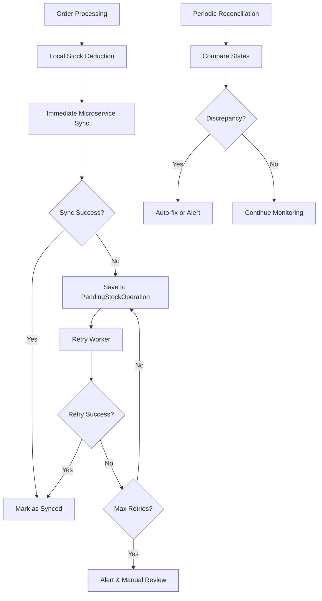

# Архитектура синхронизации складских операций для Allegro

## Обзор проблемы

В текущей архитектуре возникла проблема с синхронизацией состояния списания товаров между локальной системой управления складом и внешним микросервисом Allegro:

- **Старая логика**: При получении заказа автоматически списывался stock локально
- **Новая архитектура**: Заказы подтягиваются из микросервиса, информация о списании храниться там
- **Проблема**: Два источника истины могут рассинхронизироваться

## Архитектурное решение: Hybrid Synchronization Pattern

### Принципы решения

1. **Immediate Consistency** - мгновенная попытка синхронизации при операции
2. **Eventual Consistency** - гарантированная итоговая согласованность через retry
3. **Outbox Pattern** - надежная доставка изменений через промежуточное хранилище
4. **Idempotency** - безопасность повторных операций
5. **Compensating Actions** - возможность отката при сбоях

### Компоненты архитектуры



## Модели данных

### PendingStockOperation

```python
class PendingStockOperation(SQLModel, table=True):
    """Модель для отслеживания неудачных операций синхронизации."""
    
    id: UUID = Field(default_factory=uuid4, primary_key=True)
    order_id: str = Field(index=True)
    operation_type: str  # "deduction", "refund", "adjustment"
    status: str = Field(default="pending")  # "pending", "processing", "completed", "failed"
    
    # Детали операции
    sku: str
    quantity: int
    warehouse: str = Field(default="Ирина")
    
    # Retry механизм
    retry_count: int = Field(default=0)
    max_retries: int = Field(default=5)
    next_retry_at: datetime
    
    # Метаданные
    created_at: datetime = Field(default_factory=datetime.utcnow)
    updated_at: datetime = Field(default_factory=datetime.utcnow)
    error_message: Optional[str] = None
    
    # Связь с заказом
    allegro_order_id: Optional[str] = Field(foreign_key="allegro_orders.id")
```

### StockSynchronizationLog

```python
class StockSynchronizationLog(SQLModel, table=True):
    """Лог всех операций синхронизации для аудита."""
    
    id: UUID = Field(default_factory=uuid4, primary_key=True)
    operation_id: UUID = Field(foreign_key="pendingstockoperation.id")
    action: str  # "created", "retry", "completed", "failed", "rolled_back"
    status: str
    details: Dict[str, Any] = Field(sa_type=JSON)
    timestamp: datetime = Field(default_factory=datetime.utcnow)
```

## Сервисы

### StockSynchronizationService

Основной сервис для управления синхронизацией:

```python
class StockSynchronizationService:
    def __init__(self, session: Session, orders_client: OrdersClient):
        self.session = session
        self.orders_client = orders_client
        self.logger = logging.getLogger("stock.sync")
    
    async def sync_stock_deduction(
        self,
        order_id: str,
        sku: str,
        quantity: int,
        warehouse: str = "Ирина"
    ) -> SyncResult:
        """Синхронное списание с немедленной попыткой обновления микросервиса."""
        
    async def process_pending_operations(self) -> ProcessingResult:
        """Обработка операций из очереди с retry логикой."""
        
    async def reconcile_stock_status(
        self,
        token_id: UUID,
        limit: int = 100
    ) -> ReconciliationResult:
        """Сверка состояний между локальной системой и микросервисом."""
        
    async def rollback_operation(
        self,
        operation_id: UUID
    ) -> RollbackResult:
        """Откат операции при критических сбоях."""
```

### AllegroStockSyncIntegration

Интеграция с существующим AllegroStockService:

```python
class AllegroStockSyncIntegration:
    def __init__(
        self,
        stock_service: AllegroStockService,
        sync_service: StockSynchronizationService
    ):
        self.stock_service = stock_service
        self.sync_service = sync_service
    
    async def process_order_with_sync(
        self,
        order: AllegroOrder,
        warehouse: str,
        **kwargs
    ) -> ProcessingResult:
        """Обработка заказа с гарантированной синхронизацией."""
```

## Workflow синхронизации

### 1. Обработка нового заказа

```python
async def process_new_order(order_data: dict, token_id: str):
    # 1. Локальное списание товара
    inventory_manager = get_manager()
    for line_item in order_data["lineItems"]:
        sku = line_item["offer"]["external"]["id"]
        quantity = line_item["quantity"]
        
        inventory_manager.remove_as_sale(sku, "Ирина", quantity)
    
    # 2. Немедленная попытка синхронизации с микросервисом
    sync_result = await sync_service.sync_stock_deduction(
        order_id=order_data["id"],
        sku=sku,
        quantity=quantity
    )
    
    # 3. При неудаче - сохранение в очередь
    if not sync_result.success:
        await sync_service.create_pending_operation(
            order_id=order_data["id"],
            operation_type="deduction",
            sku=sku,
            quantity=quantity
        )
```

### 2. Retry механизм

```python
async def retry_failed_operations():
    """Celery задача для обработки неудачных операций."""
    
    # Получаем операции готовые для retry
    pending_ops = await sync_service.get_ready_for_retry()
    
    for operation in pending_ops:
        try:
            # Попытка синхронизации
            result = await orders_client.update_stock_status(
                token_id=operation.token_id,
                order_id=operation.order_id,
                is_stock_updated=True
            )
            
            if result.success:
                await sync_service.mark_completed(operation.id)
            else:
                await sync_service.increment_retry(operation.id)
                
        except Exception as e:
            await sync_service.handle_retry_error(operation.id, str(e))
```

### 3. Периодическая сверка

```python
async def reconcile_stock_states():
    """Celery задача для периодической сверки состояний."""
    
    # Получаем заказы с потенциальными расхождениями
    discrepancies = await sync_service.find_discrepancies()
    
    for discrepancy in discrepancies:
        # Определяем источник истины
        local_state = inventory_manager.get_sale_by_order(discrepancy.order_id)
        remote_state = await orders_client.get_order_by_id(
            token_id=discrepancy.token_id,
            order_id=discrepancy.order_id
        )
        
        # Автоматическое исправление или алерт
        if can_auto_fix(local_state, remote_state):
            await sync_service.auto_fix_discrepancy(discrepancy)
        else:
            await sync_service.create_manual_review_alert(discrepancy)
```

## Конфигурация и настройки

### Retry политика

```python
STOCK_SYNC_CONFIG = {
    "retry": {
        "max_retries": 5,
        "initial_delay": 60,  # 1 минута
        "max_delay": 3600,    # 1 час
        "exponential_base": 2,
        "jitter": True
    },
    "reconciliation": {
        "interval_minutes": 30,
        "batch_size": 100,
        "auto_fix_threshold_hours": 24
    },
    "monitoring": {
        "alert_on_failed_retries": True,
        "max_pending_operations": 1000,
        "stale_operation_hours": 6
    }
}
```

## API Endpoints

### Мониторинг и управление

```python
# GET /api/v1/stock-sync/status
async def get_sync_status():
    """Общий статус синхронизации."""

# GET /api/v1/stock-sync/pending
async def get_pending_operations():
    """Список операций в очереди."""

# POST /api/v1/stock-sync/reconcile
async def trigger_reconciliation():
    """Принудительная сверка состояний."""

# POST /api/v1/stock-sync/retry/{operation_id}
async def retry_operation():
    """Повторная попытка конкретной операции."""

# POST /api/v1/stock-sync/rollback/{operation_id}
async def rollback_operation():
    """Откат операции."""
```

## Мониторинг и алерты

### Метрики для отслеживания

- Количество pending операций
- Процент успешных синхронизаций
- Среднее время retry
- Количество найденных расхождений
- Количество manual review случаев

### Алерты

```python
ALERTS_CONFIG = {
    "high_pending_operations": {
        "threshold": 100,
        "channels": ["telegram", "email"]
    },
    "sync_failure_rate": {
        "threshold": 0.1,  # 10% неудач
        "window_minutes": 30
    },
    "stale_operations": {
        "threshold_hours": 6,
        "check_interval_minutes": 60
    }
}
```

## Celery задачи

```python
# Периодические задачи
@celery.task
def process_pending_stock_operations():
    """Обработка операций в очереди (каждые 5 минут)."""

@celery.task  
def reconcile_stock_states():
    """Сверка состояний (каждые 30 минут)."""

@celery.task
def cleanup_old_operations():
    """Очистка старых операций (ежедневно)."""

@celery.task
def generate_sync_report():
    """Генерация отчета о синхронизации (еженедельно)."""
```

## Тестирование

### Сценарии для тестирования

1. **Успешная синхронизация** - нормальный flow
2. **Временные сбои микросервиса** - retry механизм
3. **Длительные сбои** - manual review процесс
4. **Расхождения в данных** - reconciliation
5. **Откат операций** - rollback механизм
6. **Высокая нагрузка** - производительность системы

### Интеграционные тесты

```python
async def test_full_sync_workflow():
    """Тест полного цикла синхронизации."""
    
async def test_retry_mechanism():
    """Тест retry при сбоях."""
    
async def test_reconciliation():
    """Тест сверки состояний."""
    
async def test_rollback():
    """Тест отката операций."""
```

## Миграция и развертывание

### План миграции

1. **Фаза 1**: Создание новых моделей и сервисов
2. **Фаза 2**: Интеграция с существующим кодом
3. **Фаза 3**: Постепенное включение синхронизации
4. **Фаза 4**: Мониторинг и оптимизация

### Обратная совместимость

- Существующий код продолжает работать
- Постепенное включение новой логики
- Возможность отката к старой схеме

## Заключение

Предложенная архитектура обеспечивает:

✅ **Надежность** - система работает даже при сбоях микросервиса
✅ **Консистентность** - гарантированная итоговая согласованность данных
✅ **Мониторинг** - полная видимость состояния синхронизации
✅ **Восстанавливаемость** - автоматическое восстановление после сбоев
✅ **Масштабируемость** - поддержка высокой нагрузки
✅ **Обслуживаемость** - простота отладки и администрирования

Этот подход минимизирует риски потери данных и обеспечивает стабильную работу системы управления складскими запасами.